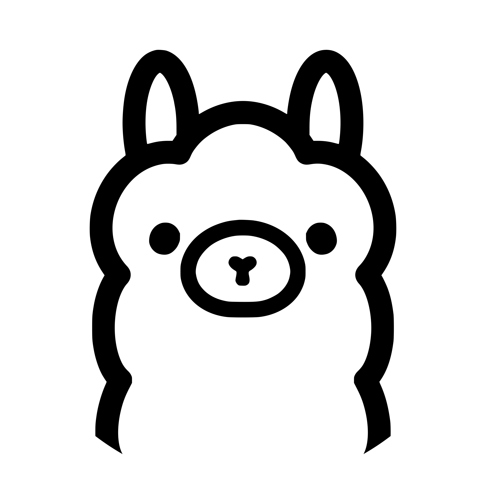
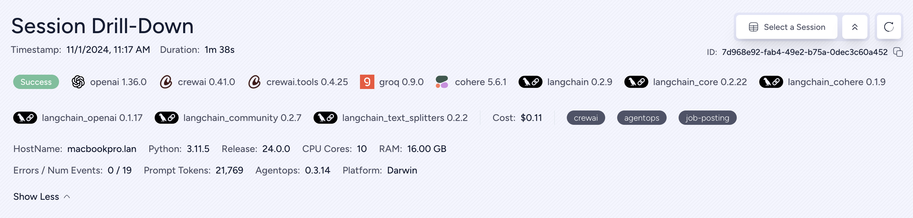

<div align="center">
  <a href="https://agentops.ai?ref=gh">
    
  </a>
</div>

<div align="center">
  <em>Observability and DevTool platform for AI Agents</em>
</div>

<br />

<div align="center">
  <a href="https://pepy.tech/project/agentops">
    
  </a>
  <a href="https://github.com/agentops-ai/agentops/issues">
  
  </a>
  
  <a href="https://github.com/AgentOps-AI/agentops-ts">
    
  </a>
  <a href="https://opensource.org/licenses/MIT">
    
  </a>
  <a href="https://smithery.ai/server/@AgentOps-AI/agentops-mcp">
    
  </a>
</div>

<p align="center">
  <a href="https://twitter.com/agentopsai/">
    
  </a>
  <a href="https://discord.gg/FagdcwwXRR">
    
  </a>
  <a href="https://app.agentops.ai/?ref=gh">
    
  </a>
  <a href="https://docs.agentops.ai/introduction">
    
  </a>
  <a href="https://entelligence.ai/AgentOps-AI&agentops">
    
  </a>
</p>

<div align="center">
  <video src="https://github.com/user-attachments/assets/dfb4fa8d-d8c4-4965-9ff6-5b8514c1c22f" width="650" autoplay loop muted></video>
</div>

<br/>

AgentOps helps developers build, evaluate, and monitor AI agents. From prototype to production.

## What is AgentOps? 🤔

Without the right tools, AI agents are slow, expensive, and unreliable. Our mission is to bring your agent from prototype to production. Here's why AgentOps stands out:

- **Comprehensive Observability**: Track your AI agents' performance, user interactions, and API usage.
- **Real-Time Monitoring**: Get instant insights with session replays, metrics, and live monitoring tools.
- **Cost Control**: Monitor and manage your spend on LLM and API calls.
- **Failure Detection**: Quickly identify and respond to agent failures and multi-agent interaction issues.
- **Tool Usage Statistics**: Understand how your agents utilize external tools with detailed analytics.
- **Session-Wide Metrics**: Gain a holistic view of your agents' sessions with comprehensive statistics.

AgentOps is designed to make agent observability, testing, and monitoring easy.

## Popular Projects Using AgentOps 🌟

| Repository | Stars  |
| :--------  | -----: |
|  &nbsp; [geekan](https://github.com/geekan) / [MetaGPT](https://github.com/geekan/MetaGPT) | 42787 |
|  &nbsp; [run-llama](https://github.com/run-llama) / [llama_index](https://github.com/run-llama/llama_index) | 34446 |
|  &nbsp; [crewAIInc](https://github.com/crewAIInc) / [crewAI](https://github.com/crewAIInc/crewAI) | 18287 |
|  &nbsp; [camel-ai](https://github.com/camel-ai) / [camel](https://github.com/camel-ai/camel) | 5166 |
|  &nbsp; [superagent-ai](https://github.com/superagent-ai) / [superagent](https://github.com/superagent-ai/superagent) | 5050 |
|  &nbsp; [iyaja](https://github.com/iyaja) / [llama-fs](https://github.com/iyaja/llama-fs) | 4713 |
|  &nbsp; [BasedHardware](https://github.com/BasedHardware) / [Omi](https://github.com/BasedHardware/Omi) | 2723 |
|  &nbsp; [MervinPraison](https://github.com/MervinPraison) / [PraisonAI](https://github.com/MervinPraison/PraisonAI) | 2007 |

_Generated using [github-dependents-info](https://github.com/nvuillam/github-dependents-info), by [Nicolas Vuillamy](https://github.com/nvuillam)_

## Key Integrations 🔌

<div align="center" style="background-color: white; padding: 20px; border-radius: 10px; margin: 0 auto; max-width: 800px;">
  <div style="display: flex; flex-wrap: wrap; justify-content: center; align-items: center; gap: 30px; margin-bottom: 20px;">
    <a href="https://docs.agentops.ai/v2/integrations/openai_agents_python"></a>
    <a href="https://docs.agentops.ai/v1/integrations/crewai"></a>
    <a href="https://docs.ag2.ai/docs/ecosystem/agentops"></a>
    <a href="https://docs.agentops.ai/v1/integrations/microsoft"></a>
  </div>
  
  <div style="display: flex; flex-wrap: wrap; justify-content: center; align-items: center; gap: 30px; margin-bottom: 20px;">
    <a href="https://docs.agentops.ai/v1/integrations/langchain"></a>
    <a href="https://docs.agentops.ai/v1/integrations/camel"></a>
    <a href="https://docs.llamaindex.ai/en/stable/module_guides/observability/?h=agentops#agentops"></a>
    <a href="https://docs.agentops.ai/v1/integrations/cohere"></a>
  </div>
</div>

|                                       |                                                               |
| ------------------------------------- | ------------------------------------------------------------- |
| 📊 **Replay Analytics and Debugging** | Step-by-step agent execution graphs                           |
| 💸 **LLM Cost Management**            | Track spend with LLM foundation model providers               |
| 🧪 **Agent Benchmarking**             | Test your agents against 1,000+ evals                         |
| 🔐 **Compliance and Security**        | Detect common prompt injection and data exfiltration exploits |
| 🤝 **Framework Integrations**         | Native Integrations with CrewAI, AG2 (AutoGen), Camel AI, & LangChain         |

## Quick Start ⌨️

```bash
pip install agentops
```


#### Session replays in 2 lines of code

Initialize the AgentOps client and automatically get analytics on all your LLM calls.

[Get an API key](https://app.agentops.ai/settings/projects)

```python
import agentops

# Beginning of your program (i.e. main.py, __init__.py)
agentops.init()  # Set AGENTOPS_API_KEY in your environment

# Your agent code here...

# End of program
agentops.end_session('Success')
```

All your sessions can be viewed on the [AgentOps dashboard](https://app.agentops.ai?ref=gh)

<details>
  <summary>Dashboard Features</summary>
  <a href="https://app.agentops.ai?ref=gh">
    
  </a>
  <a href="https://app.agentops.ai?ref=gh">
    
  </a>
</details>

### Advanced Features

AgentOps provides powerful observability with minimal code changes. For advanced usage including decorators, trace management, and custom instrumentation, see our [comprehensive documentation](https://docs.agentops.ai).

Key features include:
- **Decorator System**: `@trace`, `@agent`, `@operation`, `@tool` decorators for detailed instrumentation
- **Manual Trace Control**: Start/stop traces programmatically for complex workflows  
- **Multi-Agent Support**: Track interactions between multiple agents
- **Cost Tracking**: Monitor LLM API costs and token usage
- **Custom Metadata**: Add context and tags to your traces

📖 [View full documentation](https://docs.agentops.ai) | 🎯 [SDK Reference](https://docs.agentops.ai/v2/usage/sdk-reference) | 🔧 [Advanced Configuration](https://docs.agentops.ai/v2/usage/advanced-configuration)

## Integrations 🦾

### OpenAI Agents SDK 🖇️

Build multi-agent systems with tools, handoffs, and guardrails. AgentOps natively integrates with the OpenAI Agents SDKs for both Python and TypeScript.

**Installation**: `pip install openai-agents` (Python) or `npm install agentops @openai/agents` (TypeScript)

📖 [Python integration guide](https://docs.agentops.ai/v2/integrations/openai_agents_python) | [TypeScript integration guide](https://docs.agentops.ai/v2/integrations/openai_agents_js)

### CrewAI 🛶

Build Crew agents with observability in just 2 lines of code. Simply set an `AGENTOPS_API_KEY` in your environment for automatic monitoring.

**Installation**: `pip install 'crewai[agentops]'`

📖 [AgentOps integration guide](https://docs.agentops.ai/v1/integrations/crewai) | [Official CrewAI docs](https://docs.crewai.com/how-to/AgentOps-Observability)

### AG2 🤖

Add full observability and monitoring to AG2 (formerly AutoGen) agents with just two lines of code.

📖 [AG2 Observability Example](https://docs.ag2.ai/notebooks/agentchat_agentops) | [AG2 - AgentOps Documentation](https://docs.ag2.ai/docs/ecosystem/agentops)

### Camel AI 🐪

Track and analyze CAMEL agents with full observability. Advanced agent communication framework with comprehensive monitoring.

**Installation**: `pip install "camel-ai[all]" agentops`

📖 [AgentOps integration guide](https://docs.agentops.ai/v1/integrations/camel) | [Official Camel AI docs](https://docs.camel-ai.org/cookbooks/agents_tracking.html)

### Langchain 🦜🔗

AgentOps works seamlessly with applications built using Langchain through callback handlers.

**Installation**: `pip install agentops[langchain]`

📖 [Langchain integration guide](https://docs.agentops.ai/v1/integrations/langchain) | [Examples notebook](./examples/langchain/langchain_examples.ipynb)

### Cohere ⌨️

First class support for Cohere (>=5.4.0) with automatic instrumentation for chat and streaming.

**Installation**: `pip install cohere agentops`

📖 [AgentOps integration guide](https://docs.agentops.ai/v1/integrations/cohere) | [Official Cohere docs](https://docs.cohere.com/reference/about)


### Anthropic ﹨

Track agents built with the Anthropic Python SDK (>=0.32.0) with support for streaming and async operations.

**Installation**: `pip install anthropic agentops`

📖 [AgentOps integration guide](https://docs.agentops.ai/v1/integrations/anthropic) | [Official Anthropic docs](https://docs.anthropic.com/en/docs/welcome)

### Mistral 〽️

Track agents built with the Mistral Python SDK (>=0.32.0) with support for sync, streaming, and async operations.

**Installation**: `pip install mistralai agentops`

📖 [AgentOps integration example](./examples/mistral/mistral_example.ipynb) | [Official Mistral docs](https://docs.mistral.ai)


### CamelAI ﹨

Track agents built with the CamelAI Python SDK (>=0.32.0) for advanced agent communication frameworks.

**Installation**: `pip install camel-ai[all] agentops`

📖 [CamelAI integration guide](https://docs.camel-ai.org/cookbooks/agents_tracking.html) | [Usage examples](examples/camelai_examples/README.md)


### LiteLLM 🚅

AgentOps provides support for LiteLLM (>=1.3.1), allowing you to call 100+ LLMs using the same Input/Output Format.

**Installation**: `pip install litellm agentops`

📖 [AgentOps integration guide](https://docs.agentops.ai/v1/integrations/litellm) | [Official LiteLLM docs](https://docs.litellm.ai/docs/providers)

### LlamaIndex 🦙

AgentOps works seamlessly with LlamaIndex, a framework for building context-augmented generative AI applications with LLMs.

**Installation**: `pip install llama-index-instrumentation-agentops`

📖 [LlamaIndex integration guide](https://docs.llamaindex.ai/en/stable/module_guides/observability/?h=agentops#agentops)

### Llama Stack 🦙🥞

AgentOps provides support for Llama Stack Python Client (>=0.0.53), allowing you to monitor your Agentic applications.

📖 [Integration examples](https://github.com/AgentOps-AI/agentops/pull/530) | [Official Llama Stack Client](https://github.com/meta-llama/llama-stack-client-python)

### SwarmZero AI 🐝

Track and analyze SwarmZero agents with full observability. Advanced multi-agent framework with comprehensive monitoring.

**Installation**: `pip install swarmzero agentops`

📖 [AgentOps integration guide](https://docs.agentops.ai/v1/integrations/swarmzero) | [SwarmZero docs](https://docs.swarmzero.ai/sdk/observability/agentops) | [Official SDK](https://github.com/swarmzero/swarmzero)

## Evaluations Roadmap 🧭

| Platform                                                                     | Dashboard                                  | Evals                                  |
| ---------------------------------------------------------------------------- | ------------------------------------------ | -------------------------------------- |
| ✅ Python SDK                                                                | ✅ Multi-session and Cross-session metrics | ✅ Custom eval metrics                 |
| 🚧 Evaluation builder API                                                    | ✅ Custom event tag tracking              | 🔜 Agent scorecards                    |
| 🚧 [Javascript/Typescript SDK (Alpha)](https://github.com/AgentOps-AI/agentops-node) | ✅ Session replays                         | 🔜 Evaluation playground + leaderboard |

## Debugging Roadmap 🧭

| Performance testing                       | Environments                                                                        | LLM Testing                                 | Reasoning and execution testing                   |
| ----------------------------------------- | ----------------------------------------------------------------------------------- | ------------------------------------------- | ------------------------------------------------- |
| ✅ Event latency analysis                 | 🔜 Non-stationary environment testing                                               | 🔜 LLM non-deterministic function detection | 🚧 Infinite loops and recursive thought detection |
| ✅ Agent workflow execution pricing       | 🔜 Multi-modal environments                                                         | 🚧 Token limit overflow flags               | 🔜 Faulty reasoning detection                     |
| 🚧 Success validators (external)          | 🔜 Execution containers                                                             | 🔜 Context limit overflow flags             | 🔜 Generative code validators                     |
| 🔜 Agent controllers/skill tests          | ✅ Honeypot and prompt injection detection ([PromptArmor](https://promptarmor.com)) | ✅ API bill tracking                        | 🔜 Error breakpoint analysis                      |
| 🔜 Information context constraint testing | 🔜 Anti-agent roadblocks (i.e. Captchas)                                            | 🔜 CI/CD integration checks                 |                                                   |
| 🔜 Regression testing                     | ✅ Multi-agent framework visualization                                              |                                             |                                                   |

## Star History

Check out our growth in the community:


