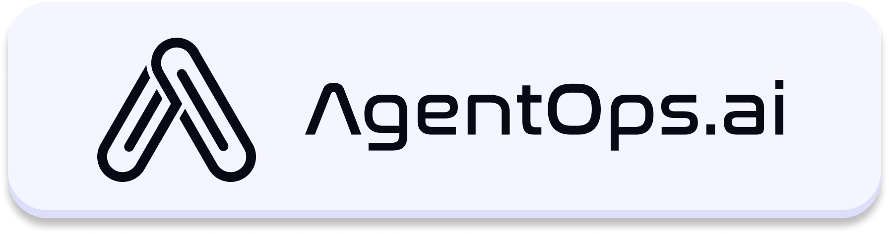
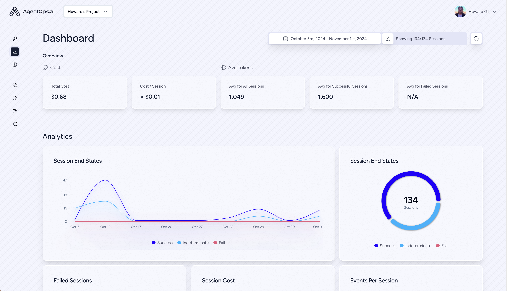

<div align="center">
  <a href="https://agentops.ai?ref=gh">
    
  </a>
</div>

<div align="center">
  <em>Observability and DevTool platform for AI Agents</em>
</div>

<br />

<div align="center">
  <a href="https://pepy.tech/project/agentops">
    
  </a>
  <a href="https://github.com/agentops-ai/agentops/issues">
  
  </a>
  
  <a href="https://opensource.org/licenses/MIT">
    
  </a>
</div>

<p align="center">
<a href="https://twitter.com/agentopsai/">🐦 Twitter</a>
<span>&nbsp;&nbsp;•&nbsp;&nbsp;</span>
<a href="https://discord.gg/FagdcwwXRR">📢 Discord</a>
<span>&nbsp;&nbsp;•&nbsp;&nbsp;</span>
<a href="https://app.agentops.ai/?ref=gh">🖇️ Dashboard</a>
<span>&nbsp;&nbsp;•&nbsp;&nbsp;</span>
<a href="https://docs.agentops.ai/introduction">📙 Documentation</a>
</p>

<div style="justify-content: center">
  
</div>

<br/>


AgentOps helps developers build, evaluate, and monitor AI agents. From prototype to production.

|                                       |                                                               |
| ------------------------------------- | ------------------------------------------------------------- |
| 📊 **Replay Analytics and Debugging** | Step-by-step agent execution graphs                           |
| 💸 **LLM Cost Management**            | Track spend with LLM foundation model providers               |
| 🧪 **Agent Benchmarking**             | Test your agents against 1,000+ evals                         |
| 🔐 **Compliance and Security**        | Detect common prompt injection and data exfiltration exploits |
| 🤝 **Framework Integrations**         | Native Integrations with CrewAI, AutoGen, & LangChain         |

## Quick Start ⌨️

```bash
pip install agentops
```


#### Session replays in 2 lines of code

Initialize the AgentOps client and automatically get analytics on all your LLM calls.

[Get an API key](https://app.agentops.ai/settings/projects)

```python
import agentops

# Beginning of your program (i.e. main.py, __init__.py)
agentops.init( < INSERT YOUR API KEY HERE >)

...

# End of program
agentops.end_session('Success')
```

All your sessions can be viewed on the [AgentOps dashboard](https://app.agentops.ai?ref=gh)
<br/>

<details>
  <summary>Agent Debugging</summary>
  <a href="https://app.agentops.ai?ref=gh">
    
  </a>
</details>

<details>
  <summary>Session Replays</summary>
  <a href="https://app.agentops.ai?ref=gh">
    
  </a>
</details>

<details open>
  <summary>Summary Analytics</summary>
  <a href="https://app.agentops.ai?ref=gh">
   
  </a>
</details>


### First class Developer Experience
Add powerful observability to your agents, tools, and functions with as little code as possible: one line at a time.
<br/>
Refer to our [documentation](http://docs.agentops.ai)

```python
# Automatically associate all Events with the agent that originated them
from agentops import track_agent

@track_agent(name='SomeCustomName')
class MyAgent:
  ...
```

```python
# Automatically create ToolEvents for tools that agents will use
from agentops import record_tool

@record_tool('SampleToolName')
def sample_tool(...):
  ...
```

```python
# Automatically create ActionEvents for other functions.
from agentops import record_action

@agentops.record_action('sample function being record')
def sample_function(...):
  ...
```

```python
# Manually record any other Events
from agentops import record, ActionEvent

record(ActionEvent("received_user_input"))
```

## Integrations 🦾

### CrewAI 🛶

Build Crew agents with observability with only 2 lines of code. Simply set an `AGENTOPS_API_KEY` in your environment, and your crews will get automatic monitoring on the AgentOps dashboard.

```bash
pip install 'crewai[agentops]'
```

- [AgentOps integration example](https://docs.agentops.ai/v1/integrations/crewai)
- [Official CrewAI documentation](https://docs.crewai.com/how-to/AgentOps-Observability)

### AutoGen 🤖
With only two lines of code, add full observability and monitoring to Autogen agents. Set an `AGENTOPS_API_KEY` in your environment and call `agentops.init()`

- [Autogen Observability Example](https://microsoft.github.io/autogen/docs/notebooks/agentchat_agentops)
- [Autogen - AgentOps Documentation](https://microsoft.github.io/autogen/docs/ecosystem/agentops)

### Langchain 🦜🔗

AgentOps works seamlessly with applications built using Langchain. To use the handler, install Langchain as an optional dependency:

<details>
  <summary>Installation</summary>
  
```shell
pip install agentops[langchain]
```

To use the handler, import and set

```python
import os
from langchain.chat_models import ChatOpenAI
from langchain.agents import initialize_agent, AgentType
from agentops.partners.langchain_callback_handler import LangchainCallbackHandler

AGENTOPS_API_KEY = os.environ['AGENTOPS_API_KEY']
handler = LangchainCallbackHandler(api_key=AGENTOPS_API_KEY, tags=['Langchain Example'])

llm = ChatOpenAI(openai_api_key=OPENAI_API_KEY,
                 callbacks=[handler],
                 model='gpt-3.5-turbo')

agent = initialize_agent(tools,
                         llm,
                         agent=AgentType.CHAT_ZERO_SHOT_REACT_DESCRIPTION,
                         verbose=True,
                         callbacks=[handler], # You must pass in a callback handler to record your agent
                         handle_parsing_errors=True)
```

Check out the [Langchain Examples Notebook](./examples/langchain_examples.ipynb) for more details including Async handlers.

</details>

### Cohere ⌨️

First class support for Cohere(>=5.4.0). This is a living integration, should you need any added functionality please message us on Discord!

- [AgentOps integration example](https://docs.agentops.ai/v1/integrations/cohere)
- [Official Cohere documentation](https://docs.cohere.com/reference/about)

<details>
  <summary>Installation</summary>
  
```bash
pip install cohere
```

```python python
import cohere
import agentops

# Beginning of program's code (i.e. main.py, __init__.py)
agentops.init(<INSERT YOUR API KEY HERE>)
co = cohere.Client()

chat = co.chat(
    message="Is it pronounced ceaux-hear or co-hehray?"
)

print(chat)

agentops.end_session('Success')
```

```python python
import cohere
import agentops

# Beginning of program's code (i.e. main.py, __init__.py)
agentops.init(<INSERT YOUR API KEY HERE>)

co = cohere.Client()

stream = co.chat_stream(
    message="Write me a haiku about the synergies between Cohere and AgentOps"
)

for event in stream:
    if event.event_type == "text-generation":
        print(event.text, end='')

agentops.end_session('Success')
```
</details>


### Anthropic ﹨

Track agents built with the Anthropic Python SDK (>=0.32.0).

- [AgentOps integration example](examples/anthropic-sdk/anthropic_example.ipynb)
- [Official Anthropic documentation](https://docs.anthropic.com/en/docs/welcome)

<details>
  <summary>Installation</summary>
  
```bash
pip install anthropic
```

```python python
import anthropic
import agentops

# Beginning of program's code (i.e. main.py, __init__.py)
agentops.init(<INSERT YOUR API KEY HERE>)

client = anthropic.Anthropic(
    # This is the default and can be omitted
    api_key=os.environ.get("ANTHROPIC_API_KEY"),
)

message = client.messages.create(
        max_tokens=1024,
        messages=[
            {
                "role": "user",
                "content": "Tell me a cool fact about AgentOps",
            }
        ],
        model="claude-3-opus-20240229",
    )
print(message.content)

agentops.end_session('Success')
```

Streaming
```python python
import anthropic
import agentops

# Beginning of program's code (i.e. main.py, __init__.py)
agentops.init(<INSERT YOUR API KEY HERE>)

client = anthropic.Anthropic(
    # This is the default and can be omitted
    api_key=os.environ.get("ANTHROPIC_API_KEY"),
)

stream = client.messages.create(
    max_tokens=1024,
    model="claude-3-opus-20240229",
    messages=[
        {
            "role": "user",
            "content": "Tell me something cool about streaming agents",
        }
    ],
    stream=True,
)

response = ""
for event in stream:
    if event.type == "content_block_delta":
        response += event.delta.text
    elif event.type == "message_stop":
        print("\n")
        print(response)
        print("\n")
```

Async

```python python
import asyncio
from anthropic import AsyncAnthropic

client = AsyncAnthropic(
    # This is the default and can be omitted
    api_key=os.environ.get("ANTHROPIC_API_KEY"),
)


async def main() -> None:
    message = await client.messages.create(
        max_tokens=1024,
        messages=[
            {
                "role": "user",
                "content": "Tell me something interesting about async agents",
            }
        ],
        model="claude-3-opus-20240229",
    )
    print(message.content)


await main()
```
</details>

### LiteLLM 🚅

AgentOps provides support for LiteLLM(>=1.3.1), allowing you to call 100+ LLMs using the same Input/Output Format. 

- [AgentOps integration example](https://docs.agentops.ai/v1/integrations/litellm)
- [Official LiteLLM documentation](https://docs.litellm.ai/docs/providers)

<details>
  <summary>Installation</summary>
  
```bash
pip install litellm
```

```python python
# Do not use LiteLLM like this
# from litellm import completion
# ...
# response = completion(model="claude-3", messages=messages)

# Use LiteLLM like this
import litellm
...
response = litellm.completion(model="claude-3", messages=messages)
# or
response = await litellm.acompletion(model="claude-3", messages=messages)
```
</details>

### LlamaIndex 🦙


AgentOps works seamlessly with applications built using LlamaIndex, a framework for building context-augmented generative AI applications with LLMs.

<details>
  <summary>Installation</summary>
  
```shell
pip install llama-index-instrumentation-agentops
```

To use the handler, import and set

```python
from llama_index.core import set_global_handler

# NOTE: Feel free to set your AgentOps environment variables (e.g., 'AGENTOPS_API_KEY')
# as outlined in the AgentOps documentation, or pass the equivalent keyword arguments
# anticipated by AgentOps' AOClient as **eval_params in set_global_handler.

set_global_handler("agentops")
```

Check out the [LlamaIndex docs](https://docs.llamaindex.ai/en/stable/module_guides/observability/?h=agentops#agentops) for more details.

</details>

## Time travel debugging 🔮

<div style="justify-content: center">
  
</div>

<br />

[Try it out!](https://app.agentops.ai/timetravel)

## Agent Arena 🥊

(coming soon!)

## Evaluations Roadmap 🧭

| Platform                                                                     | Dashboard                                  | Evals                                  |
| ---------------------------------------------------------------------------- | ------------------------------------------ | -------------------------------------- |
| ✅ Python SDK                                                                | ✅ Multi-session and Cross-session metrics | ✅ Custom eval metrics                 |
| 🚧 Evaluation builder API                                                    | ✅ Custom event tag tracking               | 🔜 Agent scorecards                    |
| ✅ [Javascript/Typescript SDK](https://github.com/AgentOps-AI/agentops-node) | ✅ Session replays                         | 🔜 Evaluation playground + leaderboard |

## Debugging Roadmap 🧭

| Performance testing                       | Environments                                                                        | LLM Testing                                 | Reasoning and execution testing                   |
| ----------------------------------------- | ----------------------------------------------------------------------------------- | ------------------------------------------- | ------------------------------------------------- |
| ✅ Event latency analysis                 | 🔜 Non-stationary environment testing                                               | 🔜 LLM non-deterministic function detection | 🚧 Infinite loops and recursive thought detection |
| ✅ Agent workflow execution pricing       | 🔜 Multi-modal environments                                                         | 🚧 Token limit overflow flags               | 🔜 Faulty reasoning detection                     |
| 🚧 Success validators (external)          | 🔜 Execution containers                                                             | 🔜 Context limit overflow flags             | 🔜 Generative code validators                     |
| 🔜 Agent controllers/skill tests          | ✅ Honeypot and prompt injection detection ([PromptArmor](https://promptarmor.com)) | 🔜 API bill tracking                        | 🔜 Error breakpoint analysis                      |
| 🔜 Information context constraint testing | 🔜 Anti-agent roadblocks (i.e. Captchas)                                            | 🔜 CI/CD integration checks                 |                                                   |
| 🔜 Regression testing                     | 🔜 Multi-agent framework visualization                                              |                                             |                                                   |

### Why AgentOps? 🤔

Without the right tools, AI agents are slow, expensive, and unreliable. Our mission is to bring your agent from prototype to production. Here's why AgentOps stands out:

- **Comprehensive Observability**: Track your AI agents' performance, user interactions, and API usage.
- **Real-Time Monitoring**: Get instant insights with session replays, metrics, and live monitoring tools.
- **Cost Control**: Monitor and manage your spend on LLM and API calls.
- **Failure Detection**: Quickly identify and respond to agent failures and multi-agent interaction issues.
- **Tool Usage Statistics**: Understand how your agents utilize external tools with detailed analytics.
- **Session-Wide Metrics**: Gain a holistic view of your agents' sessions with comprehensive statistics.

AgentOps is designed to make agent observability, testing, and monitoring easy.


## Star History

Check out our growth in the community:


## Popular projects using AgentOps


| Repository | Stars  |
| :--------  | -----: |
|  &nbsp; [geekan](https://github.com/geekan) / [MetaGPT](https://github.com/geekan/MetaGPT) | 42787 |
|  &nbsp; [run-llama](https://github.com/run-llama) / [llama_index](https://github.com/run-llama/llama_index) | 34446 |
|  &nbsp; [crewAIInc](https://github.com/crewAIInc) / [crewAI](https://github.com/crewAIInc/crewAI) | 18287 |
|  &nbsp; [camel-ai](https://github.com/camel-ai) / [camel](https://github.com/camel-ai/camel) | 5166 |
|  &nbsp; [superagent-ai](https://github.com/superagent-ai) / [superagent](https://github.com/superagent-ai/superagent) | 5050 |
|  &nbsp; [iyaja](https://github.com/iyaja) / [llama-fs](https://github.com/iyaja/llama-fs) | 4713 |
|  &nbsp; [BasedHardware](https://github.com/BasedHardware) / [Omi](https://github.com/BasedHardware/Omi) | 2723 |
|  &nbsp; [MervinPraison](https://github.com/MervinPraison) / [PraisonAI](https://github.com/MervinPraison/PraisonAI) | 2007 |
|  &nbsp; [AgentOps-AI](https://github.com/AgentOps-AI) / [Jaiqu](https://github.com/AgentOps-AI/Jaiqu) | 272 |
|  &nbsp; [strnad](https://github.com/strnad) / [CrewAI-Studio](https://github.com/strnad/CrewAI-Studio) | 134 |
|  &nbsp; [alejandro-ao](https://github.com/alejandro-ao) / [exa-crewai](https://github.com/alejandro-ao/exa-crewai) | 55 |
|  &nbsp; [tonykipkemboi](https://github.com/tonykipkemboi) / [youtube_yapper_trapper](https://github.com/tonykipkemboi/youtube_yapper_trapper) | 47 |
|  &nbsp; [sethcoast](https://github.com/sethcoast) / [cover-letter-builder](https://github.com/sethcoast/cover-letter-builder) | 27 |
|  &nbsp; [bhancockio](https://github.com/bhancockio) / [chatgpt4o-analysis](https://github.com/bhancockio/chatgpt4o-analysis) | 19 |
|  &nbsp; [breakstring](https://github.com/breakstring) / [Agentic_Story_Book_Workflow](https://github.com/breakstring/Agentic_Story_Book_Workflow) | 14 |
|  &nbsp; [MULTI-ON](https://github.com/MULTI-ON) / [multion-python](https://github.com/MULTI-ON/multion-python) | 13 |


_Generated using [github-dependents-info](https://github.com/nvuillam/github-dependents-info), by [Nicolas Vuillamy](https://github.com/nvuillam)_
