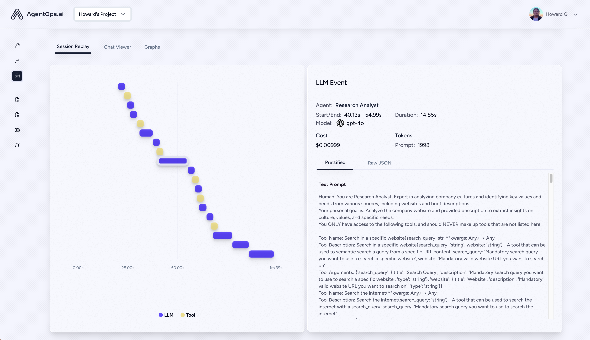

<div align="center">
  <a href="https://agentops.ai?ref=gh">
    
  </a>
</div>
<p align="center">
  <em>AI agents suck. We’re fixing that.</em>
</p>

<p align="center">
    <a href="https://pypi.org/project/agentops/" target="_blank">
        
        
    </a>
</p>
<p align="center">
<a href="https://twitter.com/agentopsai/">🐦 Twitter</a>
<span>&nbsp;&nbsp;•&nbsp;&nbsp;</span>
<a href="https://discord.gg/FagdcwwXRR">📢 Discord</a>
<span>&nbsp;&nbsp;•&nbsp;&nbsp;</span>
<a href="https://app.agentops.ai/?ref=gh">🖇️ AgentOps</a>
<span>&nbsp;&nbsp;•&nbsp;&nbsp;</span>
<a href="https://docs.agentops.ai/introduction">📙 Documentation</a>
</p>

# AgentOps 🖇️

[](https://opensource.org/licenses/MIT)

<a href="https://pepy.tech/project/agentops">
  
</a>
<a href="https://twitter.com/agentopsai">
  
</a>
<a href="https://discord.gg/mKW3ZhN9p2">
  
</a>
<a href="https://github.com/agentops-ai/agentops/issues">
  
</a>

AgentOps helps developers build, evaluate, and monitor AI agents. Tools to build agents from prototype to production.

|                                       |                                                               |
| ------------------------------------- | ------------------------------------------------------------- |
| 📊 **Replay Analytics and Debugging** | Step-by-step agent execution graphs                           |
| 💸 **LLM Cost Management**            | Track spend with LLM foundation model providers               |
| 🧪 **Agent Benchmarking**             | Test your agents against 1,000+ evals                         |
| 🔐 **Compliance and Security**        | Detect common prompt injection and data exfiltration exploits |
| 🤝 **Framework Integrations**         | Native Integrations with CrewAI, AutoGen, & LangChain         |

## Quick Start ⌨️

```bash
pip install agentops
```

### Session replays in 3 lines of code

Initialize the AgentOps client and automatically get analytics on every LLM call.

```python
import agentops

# Beginning of program's code (i.e. main.py, __init__.py)
agentops.init(<INSERT YOUR API KEY HERE>)

...
# (optional: record specific functions)
@agentops.record_function('sample function being record')
def sample_function(...):
    ...

# End of program
agentops.end_session('Success')
# Woohoo You're done 🎉
```

All your sessions are available on the [AgentOps dashboard](https://app.agentops.ai?ref=gh). Refer to our [API documentation](http://docs.agentops.ai) for detailed instructions.

<details open>
  <summary>Agent Dashboard</summary>
  <a href="https://app.agentops.ai?ref=gh">
   
  </a>
</details>

<details>
  <summary>Session Analytics</summary>
  <a href="https://app.agentops.ai?ref=gh">
    
  </a>
</details>

<details>
  <summary>Session Replays</summary>
  <a href="https://app.agentops.ai?ref=gh">
    
  </a>
</details>

## Integrations 🦾

### CrewAI 🛶

Build Crew agents with observability with only 2 lines of code. Simply set an `AGENTOPS_API_KEY` in your environment, and your crews will get automatic monitoring on the AgentOps dashboard.

AgentOps is integrated with CrewAI on a pre-release fork. Install crew with

```bash
pip install git+https://github.com/AgentOps-AI/crewAI.git@main
```

- [AgentOps integration example](https://docs.agentops.ai/v1/integrations/crewai)
- [Official CrewAI documentation](https://docs.crewai.com/how-to/AgentOps-Observability)

### AutoGen 🤖
With only two lines of code, add full observability and monitoring to Autogen agents. Set an `AGENTOPS_API_KEY` in your environment and call `agentops.init()`

- [Autogen Observability Example](https://microsoft.github.io/autogen/docs/notebooks/agentchat_agentops)
- [Autogen - AgentOps Documentation](https://microsoft.github.io/autogen/docs/ecosystem/agentops)

### Langchain 🦜🔗

AgentOps works seamlessly with applications built using Langchain. To use the handler, install Langchain as an optional dependency:

<details>
  <summary>Installation</summary>
  
```shell
pip install agentops[langchain]
```

To use the handler, import and set

```python
import os
from langchain.chat_models import ChatOpenAI
from langchain.agents import initialize_agent, AgentType
from agentops.langchain_callback_handler import LangchainCallbackHandler

AGENTOPS_API_KEY = os.environ['AGENTOPS_API_KEY']
handler = LangchainCallbackHandler(api_key=AGENTOPS_API_KEY, tags=['Langchain Example'])

llm = ChatOpenAI(openai_api_key=OPENAI_API_KEY,
                 callbacks=[handler],
                 model='gpt-3.5-turbo')

agent = initialize_agent(tools,
                         llm,
                         agent=AgentType.CHAT_ZERO_SHOT_REACT_DESCRIPTION,
                         verbose=True,
                         callbacks=[handler], # You must pass in a callback handler to record your agent
                         handle_parsing_errors=True)
```

Check out the [Langchain Examples Notebook](./examples/langchain_examples.ipynb) for more details including Async handlers.

</details>

### Cohere ⌨️

First class support for Cohere(>=5.4.0). This is a living integration, should you need any added functionality please message us on Discord!

- [AgentOps integration example](https://docs.agentops.ai/v1/integrations/cohere)
- [Official Cohere documentation](https://docs.cohere.com/reference/about)

<details>
  <summary>Installation</summary>
  
```bash
pip install cohere
```

```python python
import cohere
import agentops

# Beginning of program's code (i.e. main.py, __init__.py)
agentops.init(<INSERT YOUR API KEY HERE>)
co = cohere.Client()

chat = co.chat(
    message="Is it pronounced ceaux-hear or co-hehray?"
)

print(chat)

agentops.end_session('Success')
```

```python python
import cohere
import agentops

# Beginning of program's code (i.e. main.py, __init__.py)
agentops.init(<INSERT YOUR API KEY HERE>)

co = cohere.Client()

stream = co.chat_stream(
    message="Write me a haiku about the synergies between Cohere and AgentOps"
)

for event in stream:
    if event.event_type == "text-generation":
        print(event.text, end='')

agentops.end_session('Success')
```
</details>


### LiteLLM

AgentOps provides support for LiteLLM(>=1.3.1), allowing you to call 100+ LLMs using the same Input/Output Format. 

- [AgentOps integration example](https://docs.agentops.ai/v1/integrations/litellm)
- [Official LiteLLM documentation](https://docs.litellm.ai/docs/providers)

<details>
  <summary>Installation</summary>
  
```bash
pip install litellm
```

```python python
# Do not use LiteLLM like this
# from litellm import completion
# ...
# response = completion(model="claude-3", messages=messages)

# Use LiteLLM like this
import litellm
...
response = litellm.completion(model="claude-3", messages=messages)
# or
response = await litellm.acompletion(model="claude-3", messages=messages)
```
</details>

### LlamaIndex 🦙

(Coming Soon)

## Time travel debugging 🔮

(coming soon!)

## Agent Arena 🥊

(coming soon!)

## Evaluations Roadmap 🧭

| Platform                                                                     | Dashboard                                  | Evals                                  |
| ---------------------------------------------------------------------------- | ------------------------------------------ | -------------------------------------- |
| ✅ Python SDK                                                                | ✅ Multi-session and Cross-session metrics | ✅ Custom eval metrics                 |
| 🚧 Evaluation builder API                                                    | ✅ Custom event tag tracking               | 🔜 Agent scorecards                    |
| ✅ [Javascript/Typescript SDK](https://github.com/AgentOps-AI/agentops-node) | ✅ Session replays                         | 🔜 Evaluation playground + leaderboard |

## Debugging Roadmap 🧭

| Performance testing                       | Environments                                                                        | LLM Testing                                 | Reasoning and execution testing                   |
| ----------------------------------------- | ----------------------------------------------------------------------------------- | ------------------------------------------- | ------------------------------------------------- |
| ✅ Event latency analysis                 | 🔜 Non-stationary environment testing                                               | 🔜 LLM non-deterministic function detection | 🚧 Infinite loops and recursive thought detection |
| ✅ Agent workflow execution pricing       | 🔜 Multi-modal environments                                                         | 🚧 Token limit overflow flags               | 🔜 Faulty reasoning detection                     |
| 🚧 Success validators (external)          | 🔜 Execution containers                                                             | 🔜 Context limit overflow flags             | 🔜 Generative code validators                     |
| 🔜 Agent controllers/skill tests          | ✅ Honeypot and prompt injection detection ([PromptArmor](https://promptarmor.com)) | 🔜 API bill tracking                        | 🔜 Error breakpoint analysis                      |
| 🔜 Information context constraint testing | 🔜 Anti-agent roadblocks (i.e. Captchas)                                            | 🔜 CI/CD integration checks                 |                                                   |
| 🔜 Regression testing                     | 🔜 Multi-agent framework visualization                                              |                                             |                                                   |

### Why AgentOps? 🤔

Without the right tools, AI agents are slow, expensive, and unreliable. Our mission is to bring your agent from prototype to production. Here's why AgentOps stands out:

- **Comprehensive Observability**: Track your AI agents' performance, user interactions, and API usage.
- **Real-Time Monitoring**: Get instant insights with session replays, metrics, and live monitoring tools.
- **Cost Control**: Monitor and manage your spend on LLM and API calls.
- **Failure Detection**: Quickly identify and respond to agent failures and multi-agent interaction issues.
- **Tool Usage Statistics**: Understand how your agents utilize external tools with detailed analytics.
- **Session-Wide Metrics**: Gain a holistic view of your agents' sessions with comprehensive statistics.

AgentOps is designed to make agent observability, testing, and monitoring easy.


## Star History

Check out our growth in the community:


## Popular projects using AgentOps

| Repository | Stars  |
| :--------  | -----: |
|  &nbsp; [joaomdmoura](https://github.com/joaomdmoura) / [crewAI](https://github.com/joaomdmoura/crewAI) | 16888 |
|  &nbsp; [superagent-ai](https://github.com/superagent-ai) / [superagent](https://github.com/superagent-ai/superagent) | 4933 |
|  &nbsp; [iyaja](https://github.com/iyaja) / [llama-fs](https://github.com/iyaja/llama-fs) | 4507 |
|  &nbsp; [MervinPraison](https://github.com/MervinPraison) / [PraisonAI](https://github.com/MervinPraison/PraisonAI) | 1015 |
|  &nbsp; [AgentOps-AI](https://github.com/AgentOps-AI) / [Jaiqu](https://github.com/AgentOps-AI/Jaiqu) | 265 |
|  &nbsp; [tonykipkemboi](https://github.com/tonykipkemboi) / [youtube_yapper_trapper](https://github.com/tonykipkemboi/youtube_yapper_trapper) | 42 |
|  &nbsp; [alejandro-ao](https://github.com/alejandro-ao) / [exa-crewai](https://github.com/alejandro-ao/exa-crewai) | 31 |
|  &nbsp; [sethcoast](https://github.com/sethcoast) / [cover-letter-builder](https://github.com/sethcoast/cover-letter-builder) | 23 |
|  &nbsp; [bhancockio](https://github.com/bhancockio) / [chatgpt4o-analysis](https://github.com/bhancockio/chatgpt4o-analysis) | 16 |


_Generated using [github-dependents-info](https://github.com/nvuillam/github-dependents-info), by [Nicolas Vuillamy](https://github.com/nvuillam)_
