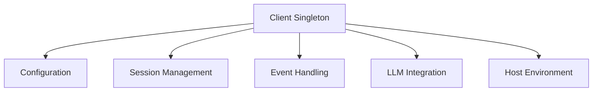
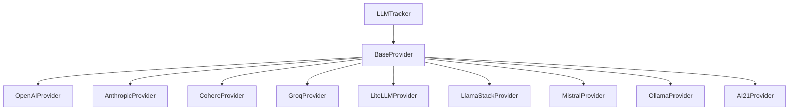
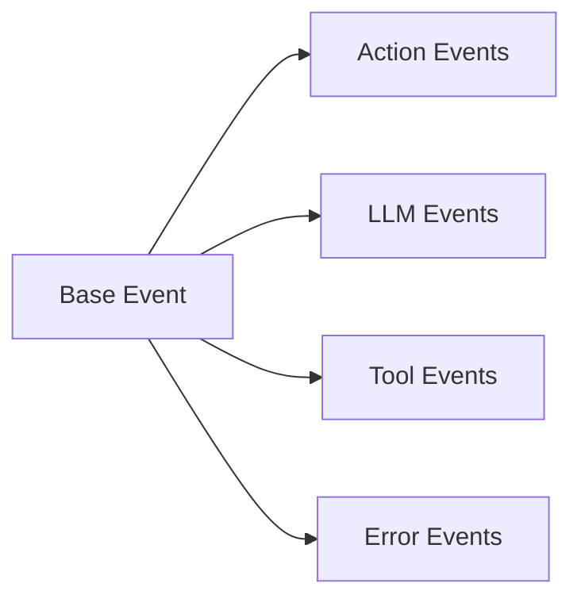
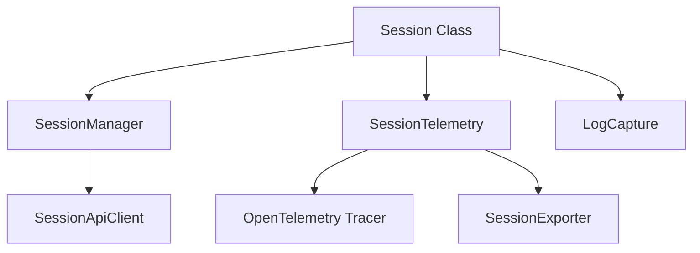

# AgentOps Architecture

## Overview

AgentOps is a Python SDK for monitoring and debugging AI agents. The codebase follows a modular design pattern with clear separation of concerns between client management, event handling, LLM provider integration, and telemetry.

## Core Components & Implementation Details

### 1. Client Management (`client.py`)



#### Implementation Details
- Uses conditional singleton pattern via metaclass (`MetaClient`)
- Manages configuration state and session lifecycle
- Handles initialization sequence:
  1. Loads environment variables
  2. Sets up configuration
  3. Initializes telemetry if enabled
  4. Sets up LLM tracking if enabled
  5. Auto-starts session if configured
- Supports multiple active sessions
- Provides session inheritance capabilities
- Handles host environment detection and reporting

### 2. LLM Provider Integration (`llms/providers/`)

#### Provider Architecture


#### Implementation Details
- Each provider inherits from `BaseProvider` abstract base class
- Uses singleton pattern for provider instances
- Supports both sync and async operations
- Handles streaming responses
- Provides method patching for API interception
- Implements time travel debugging capabilities
- Supports tool calls and function calls
- Handles provider-specific response formats

#### Key Methods
```python
class BaseProvider:
    def handle_response(self, response, kwargs, init_timestamp, session):
        # Processes provider responses
        # Creates appropriate events
        # Handles streaming/async cases
        # Returns processed response

    def override(self):
        # Patches provider methods
        # Sets up instrumentation

    def undo_override(self):
        # Restores original provider methods
```

### 3. Event System (`event.py`)

#### Event Hierarchy


#### Implementation Details
- All events inherit from base `Event` class
- Events are dataclasses with automatic timestamp handling
- Events carry session and agent context
- Events are serializable for API transport
- Supports tool calls and function calls
- Handles streaming responses
- Captures error context and stack traces

#### Decorator System
```python
@record_action("custom_action")
def my_function():
    # Function is instrumented
    # Events are automatically created

@record_tool("custom_tool")
def my_tool():
    # Tool usage is tracked
    # Events include tool context

@track_agent("agent_name")
class MyAgent:
    # Agent is tracked
    # Events include agent context
```

### 4. Session Management (`session/`)

#### Component Structure


#### Implementation Details
- Supports multiple concurrent sessions
- Provides session inheritance
- Auto-start and auto-end capabilities
- Session-specific configuration
- Tag management
- Agent tracking within sessions
- HTTP client with retry logic

### 5. CLI System (`cli.py`)

#### Features
- Time travel debugging commands
- Session management
- Configuration management
- Debug output control

### 6. Configuration System (`config.py`)

The configuration system manages:
- API credentials and endpoints
- Queue sizes and timeouts
- Telemetry settings
- Environment detection
- Default tags and behaviors
- LLM instrumentation settings
- Session auto-start/end behavior
- Environment data collection opt-out

### 7. Error Handling & Recovery

1. **API Failures**
   - Exponential backoff retry
   - Queue persistence
   - Graceful degradation
   - Detailed error events

2. **Process Termination**
   - Signal handlers for SIGINT/SIGTERM
   - Automatic session cleanup
   - Event flush on shutdown

3. **Exception Handling**
   - Error event creation
   - Stack trace capture
   - Context preservation
   - Provider-specific error handling

### 8. Host Environment (`host_env.py`)

Collects and manages:
- SDK version information
- Python environment details
- System packages
- OS information
- CPU/RAM/Disk metrics
- Project working directory
- Virtual environment details

## Extension Points

1. **Custom Events**
```python
@dataclass
class CustomEvent(Event):
    event_type: str = "custom"
    custom_field: str
```

2. **New LLM Providers**
```python
class NewProvider(BaseProvider):
    def handle_response(self, response, ...):
        # Custom response handling
```

3. **Custom Telemetry**
```python
class CustomExporter(SpanExporter):
    def export(self, spans: Sequence[ReadableSpan]):
        # Custom export logic
```
