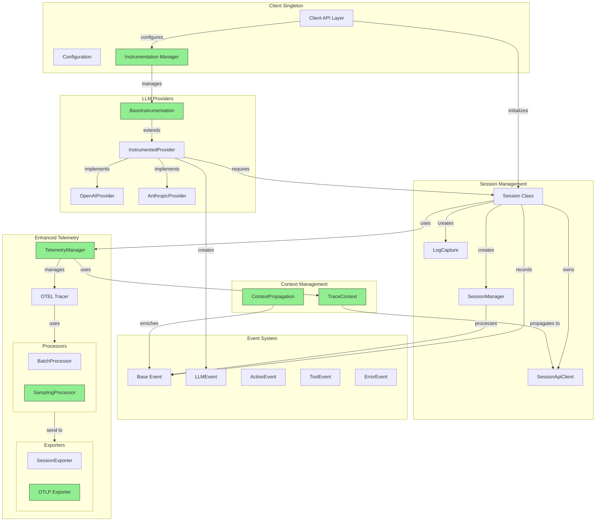

```mermaid
flowchart TB
    subgraph Client["Client Singleton"]
        Config["Configuration"]
        direction TB
        Client_API["Client API Layer"]
        InstrumentationManager["Instrumentation Manager"]
    end

    subgraph Sessions["Session Management"]
        Session["Session Class"]
        SessionManager["SessionManager"]
        LogCapture["LogCapture"]
        SessionAPI["SessionApiClient"]
    end

    subgraph Events["Event System"]
        Event["Base Event"]
        LLMEvent["LLMEvent"]
        ActionEvent["ActionEvent"]
        ToolEvent["ToolEvent"]
        ErrorEvent["ErrorEvent"]
    end

    subgraph Telemetry["Enhanced Telemetry"]
        TelemetryManager["TelemetryManager"]
        OTELTracer["OTEL Tracer"]
        
        subgraph Exporters["Exporters"]
            SessionExporter["SessionExporter"]
            OTLPExporter["OTLP Exporter"]
        end
        
        subgraph Processors["Processors"]
            BatchProcessor["BatchProcessor"]
            SamplingProcessor["SamplingProcessor"]
        end
    end

    subgraph Providers["LLM Providers"]
        BaseInstrumentation["BaseInstrumentation"]
        InstrumentedProvider["InstrumentedProvider"]
        OpenAIProvider["OpenAIProvider"]
        AnthropicProvider["AnthropicProvider"]
    end

    subgraph Context["Context Management"]
        TraceContext["TraceContext"]
        ContextPropagation["ContextPropagation"]
    end

    %% Client Relationships
    Client_API -->|initializes| Session
    Client_API -->|configures| InstrumentationManager
    InstrumentationManager -->|manages| BaseInstrumentation

    %% Session Dependencies
    Session -->|creates| SessionManager
    Session -->|uses| TelemetryManager
    Session -->|creates| LogCapture
    Session -->|owns| SessionAPI

    %% Event Flow
    InstrumentedProvider -->|creates| LLMEvent
    InstrumentedProvider -->|requires| Session
    Session -->|records| Event
    SessionManager -->|processes| Event

    %% Telemetry Flow
    TelemetryManager -->|manages| OTELTracer
    TelemetryManager -->|uses| TraceContext
    OTELTracer -->|uses| Processors
    Processors -->|send to| Exporters

    %% Provider Structure
    BaseInstrumentation -->|extends| InstrumentedProvider
    InstrumentedProvider -->|implements| OpenAIProvider
    InstrumentedProvider -->|implements| AnthropicProvider

    %% Context Flow
    ContextPropagation -->|enriches| Event
    TraceContext -->|propagates to| SessionAPI
    
    %% Highlight New/Changed Components
    style InstrumentationManager fill:#90EE90,stroke:#333
    style TelemetryManager fill:#90EE90,stroke:#333
    style BaseInstrumentation fill:#90EE90,stroke:#333
    style TraceContext fill:#90EE90,stroke:#333
    style ContextPropagation fill:#90EE90,stroke:#333
    style OTLPExporter fill:#90EE90,stroke:#333
    style SamplingProcessor fill:#90EE90,stroke:#333
```
