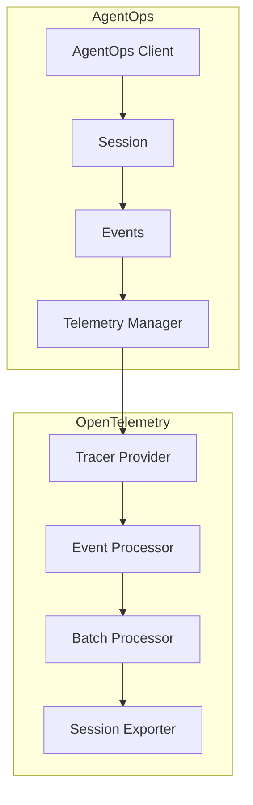
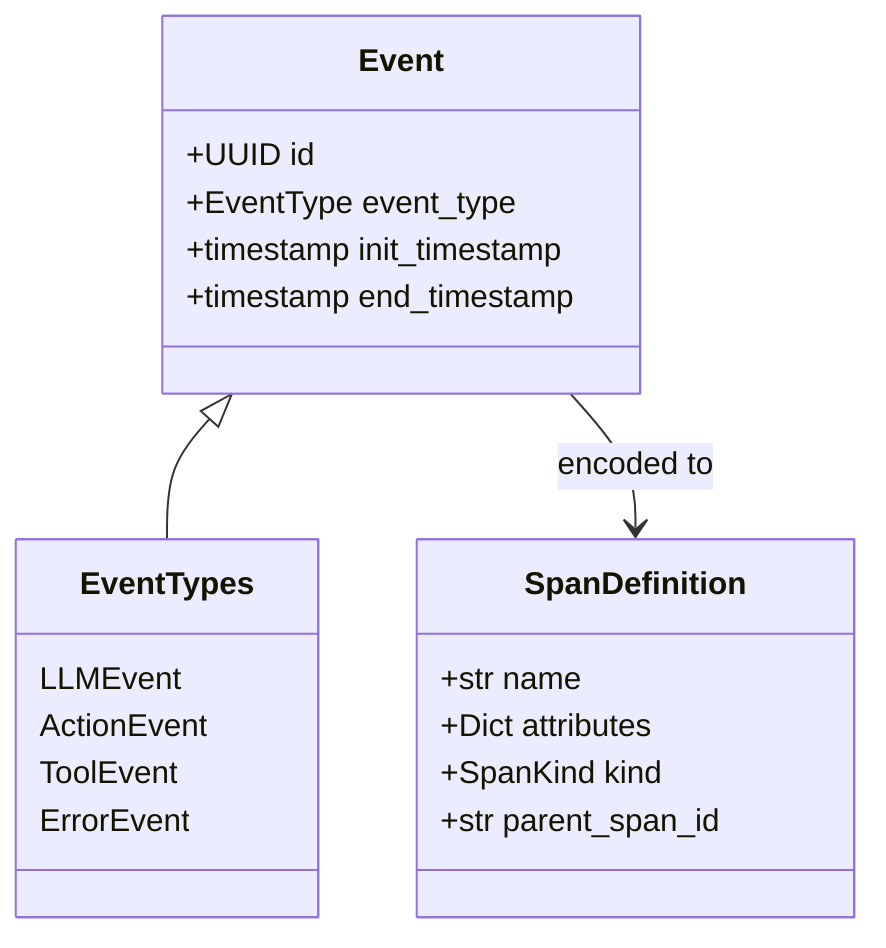

# AgentOps OpenTelemetry Integration

## Architecture Overview



## Component Overview

### TelemetryManager (`manager.py`)
- Central configuration and management of OpenTelemetry setup
- Handles TracerProvider lifecycle
- Manages session-specific exporters and processors
- Coordinates telemetry initialization and shutdown

### EventProcessor (`processors.py`)
- Processes spans for AgentOps events
- Adds session context to spans
- Tracks event counts
- Handles error propagation
- Forwards spans to wrapped processor

### SessionExporter (`exporters/session.py`)
- Exports session spans and their child event spans
- Maintains session hierarchy
- Handles batched export of spans
- Manages retry logic and error handling

### EventToSpanEncoder (`encoders.py`)
- Converts AgentOps events into OpenTelemetry span definitions
- Handles different event types (LLM, Action, Tool, Error)
- Maintains proper span relationships

## Event to Span Mapping



## Usage Example

```python
from agentops.telemetry import OTELConfig, TelemetryManager

# Configure telemetry
config = OTELConfig(
    endpoint="https://api.agentops.ai",
    api_key="your-api-key",
    enable_metrics=True
)

# Initialize telemetry manager
manager = TelemetryManager()
manager.initialize(config)

# Create session tracer
tracer = manager.create_session_tracer(
    session_id=session_id,
    jwt=jwt_token
)
```

## Configuration Options

The `OTELConfig` class supports:
- Custom exporters
- Resource attributes
- Sampling configuration
- Retry settings
- Custom formatters
- Metrics configuration
- Batch processing settings

## Key Features

1. **Session-Based Tracing**
   - Each session creates a unique trace
   - Events are tracked as spans within the session
   - Maintains proper parent-child relationships

2. **Automatic Context Management**
   - Session context propagation
   - Event type tracking
   - Error handling and status propagation

3. **Flexible Export Options**
   - Batched export support
   - Retry logic for failed exports
   - Custom formatters for span data

4. **Resource Attribution**
   - Service name and version tracking
   - Environment information
   - Deployment-specific tags

## Best Practices

1. **Configuration**
   - Always set service name and version
   - Configure appropriate batch sizes
   - Set reasonable retry limits

2. **Error Handling**
   - Use error events for failures
   - Include relevant error details
   - Maintain error context

3. **Resource Management**
   - Clean up sessions when done
   - Properly shutdown telemetry
   - Monitor resource usage

4. **Performance**
   - Use appropriate batch sizes
   - Configure export intervals
   - Monitor queue sizes
