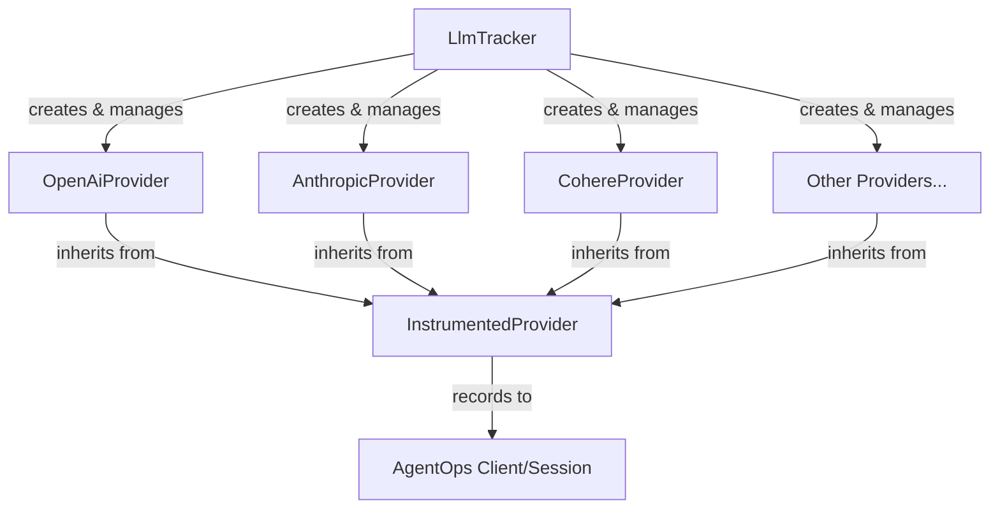

# AgentOps LLM Tracking System

This module provides instrumentation for various LLM providers to track and analyze their usage. It supports multiple providers including OpenAI, Anthropic, Cohere, Groq, Mistral, and others.

## Architecture



## Key Components

### LlmTracker (tracker.py)
The orchestrator that manages instrumentation across different LLM providers:
- Detects installed LLM packages
- Verifies version compatibility
- Initializes provider-specific instrumentation
- Provides methods to start/stop tracking

```python
from agentops import AgentOps
from agentops.llms.tracker import LlmTracker

client = AgentOps(api_key="your-key")
tracker = LlmTracker(client)

# Start tracking
tracker.override_api()

# Your LLM calls will now be tracked...

# Stop tracking
tracker.stop_instrumenting()
```

### InstrumentedProvider (instrumented_provider.py)
Abstract base class that defines the interface for provider-specific implementations:
- Provides base implementation for tracking
- Defines required methods for all providers
- Handles event recording

## Supported Providers

| Provider | Minimum Version | Tracked Methods |
|----------|----------------|-----------------|
| OpenAI | 1.0.0 | chat.completions.create, assistants API |
| Anthropic | 0.32.0 | completions.create |
| Cohere | 5.4.0 | chat, chat_stream |
| Groq | 0.9.0 | Client.chat, AsyncClient.chat |
| Mistral | 1.0.1 | chat.complete, chat.stream |
| LiteLLM | 1.3.1 | openai_chat_completions.completion |
| ... | ... | ... |

## Adding New Providers

To add support for a new LLM provider:

1. Create a new provider class in `providers/`:
```python
from .instrumented_provider import InstrumentedProvider

class NewProvider(InstrumentedProvider):
    _provider_name = "NewProvider"
    
    def override(self):
        # Implementation
        pass
        
    def undo_override(self):
        # Implementation
        pass
        
    def handle_response(self, response, kwargs, init_timestamp, session=None):
        # Implementation
        pass
```

2. Add provider configuration to `SUPPORTED_APIS` in `tracker.py`
3. Add provider to `stop_instrumenting()` method

## Event Recording

Events can be recorded to either:
- An active session (if provided)
- Directly to the AgentOps client

The `_safe_record()` method handles this routing automatically.
