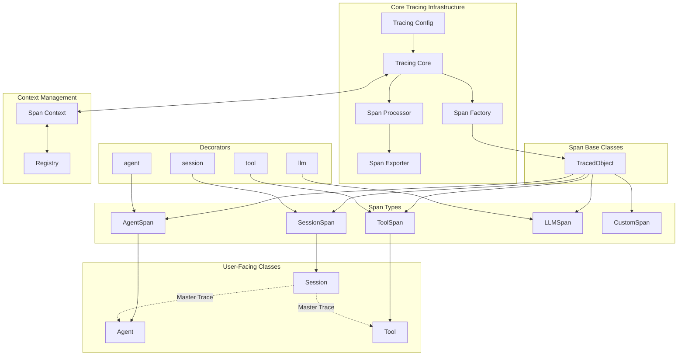

# AgentOps v0.4 Architecture

## Transition from Events to Spans

In AgentOps v0.4, we've transitioned from the "Event" concept to using "Spans" for all event tracking. This proposal outlines a new architecture that supports this transition and enables custom implementations through decorators.

## Core Concepts

1. **Session**: The master trace that serves as the root for all spans. No spans can exist without a session at the top.
2. **Spans**: Represent different types of operations (Agent, Tool, etc.) and are organized hierarchically.
3. **Decorators**: Allow users to easily mark their custom components with AgentOps-specific span types.
4. **TracingConfig**: A dedicated configuration structure for the tracing core, separate from the main application configuration.

## Architecture Diagram



## Component Descriptions

### Core Tracing Infrastructure

- **Tracing Core**: Central component that manages the creation, processing, and export of spans.
- **Tracing Config**: Configuration specific to the tracing infrastructure, separate from the main application configuration.
- **Span Factory**: Creates spans of different types based on context and decorator information.
- **Span Processor**: Processes spans (adds attributes, manages context, etc.) before they are exported.
- **Span Exporter**: Exports spans to the configured destination (e.g., AgentOps backend).

### Span Base Classes

- **TracedObject**: Base class that provides core tracing functionality (trace ID, span ID, etc.) and common span operations (start, end, attributes).

### Span Types

- **SessionSpan**: Represents a session (master trace).
- **AgentSpan**: Represents an agent operation.
- **ToolSpan**: Represents a tool operation.
- **LLMSpan**: Represents an LLM operation.
- **CustomSpan**: Allows for custom span types.

### Decorators

- **@session**: Creates a new session span.
- **@agent**: Creates a new agent span.
- **@tool**: Creates a new tool span.
- **@llm**: Creates a new LLM span.

### User-Facing Classes

- **Session**: User-facing session class that wraps SessionSpan.
- **Agent**: User-facing agent class that wraps AgentSpan.
- **Tool**: User-facing tool class that wraps ToolSpan.

### Context Management

- **Span Context**: Manages the current span context (parent-child relationships).
- **Registry**: Keeps track of active spans and their relationships.

## Implementation Considerations

1. **Decorator Implementation**:
   ```python
   def agent(cls=None, **kwargs):
       def decorator(cls):
           # Wrap methods with span creation/management
           original_init = cls.__init__
           
           def __init__(self, *args, **init_kwargs):
               # Get current session from context
               session = get_current_session()
               if not session:
                   raise ValueError("No active session found. Create a session first.")
               
               # Create agent span as child of session
               self._span = create_span("agent", parent=session.span, **kwargs)
               
               # Call original init
               original_init(self, *args, **init_kwargs)
           
           cls.__init__ = __init__
           return cls
       
       if cls is None:
           return decorator
       return decorator(cls)
   ```

2. **Session as Master Trace**:
   - All spans must have a session as their root ancestor.
   - Session creation should be explicit and precede any agent or tool operations.

3. **Context Propagation**:
   - Span context should be propagated automatically through the call stack.
   - Context should be accessible globally but thread-safe.

## Example Usage

```python
from agentops import Session, agent, tool
from agentops.sdk import TracingCore, TracingConfig

# Initialize the tracing core with a dedicated configuration
TracingCore.get_instance().initialize(
    service_name="my-service",
    exporter_endpoint="https://my-exporter-endpoint.com",
    max_queue_size=1000,
    max_wait_time=10000
)

# Create a session (master trace)
with Session() as session:
    # Create an agent
    @agent
    class MyAgent:
        def __init__(self, name):
            self.name = name
        
        def run(self):
            # Agent operations are automatically traced
            result = self.use_tool()
            return result
        
        @tool
        def use_tool(self):
            # Tool operations are automatically traced
            return "Tool result"
    
    # Use the agent
    agent = MyAgent("Agent1")
    result = agent.run()
```

## Benefits

1. **Simplified API**: Users can easily mark their components with decorators.
2. **Hierarchical Tracing**: All operations are organized hierarchically with the session as the root.
3. **Automatic Context Propagation**: Context is propagated automatically through the call stack.
4. **Extensibility**: Custom span types can be added easily.
5. **Separation of Concerns**: Tracing configuration is separate from the main application configuration.

