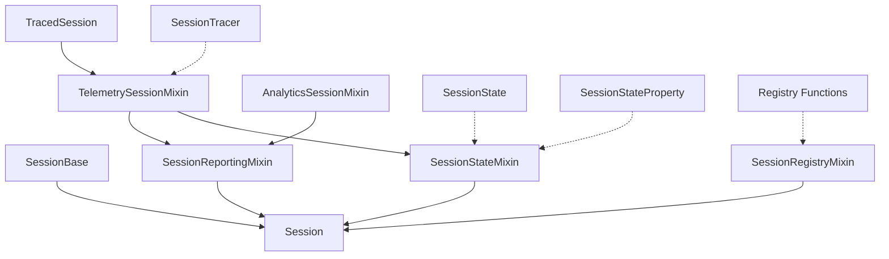

# AgentOps Session Module

The Session module is a core component of AgentOps that provides functionality for tracking and managing sessions. A Session represents a root span (also known as a trace) in AgentOps. Multiple traces can be created, and all subsequent spans generated within the context of a session will be automatically linked to that parent Session, allowing for logical grouping and hierarchical tracking of related operations.

## Architecture

The Session module follows a mixin-based architecture where different functionalities are encapsulated in separate mixins and composed together to form the final `Session` class.



## Key Components

### SessionBase
Abstract base class that defines the core interface for all Session implementations.

### Mixins
- **TelemetrySessionMixin**: Adds telemetry and span-related functionality
- **AnalyticsSessionMixin**: Adds presentation and analytics features
- **SessionReportingMixin**: Combines telemetry and analytics functionality
- **SessionRegistryMixin**: Manages session registration in the global registry
- **SessionStateMixin**: Handles session state management and transitions

### Supporting Components
- **SessionTracer**: Core session tracing functionality
- **SessionState**: Enumeration of possible session states
- **SessionStateProperty**: Property descriptor for session state management
- **Registry Functions**: Global registry for tracking active sessions

## Usage

A Session can be created and used as follows:

```python
from agentops import Session

# Create a new session
session = Session()

# Use as a context manager
with Session() as session:
    # Do work within the session context
    pass  # Session will be automatically ended

# Or manually control the session lifecycle
session = Session()
session.start()
# Do work
session.end()
```

## Session States

Sessions can be in one of the following states:
- **INITIALIZING**: Initial state when a session is created
- **RUNNING**: Active state when a session is started
- **SUCCEEDED**: Terminal state indicating successful completion
- **FAILED**: Terminal state indicating failure
- **INDETERMINATE**: Terminal state when the outcome is unknown 