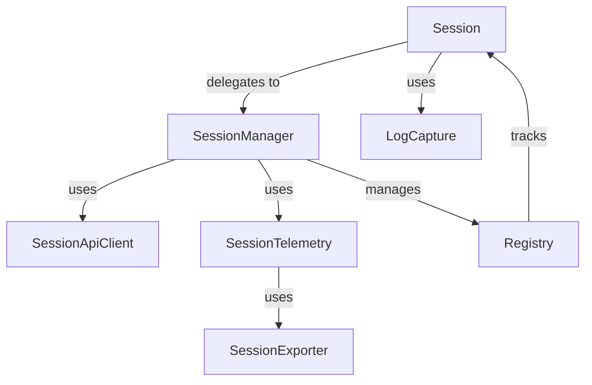
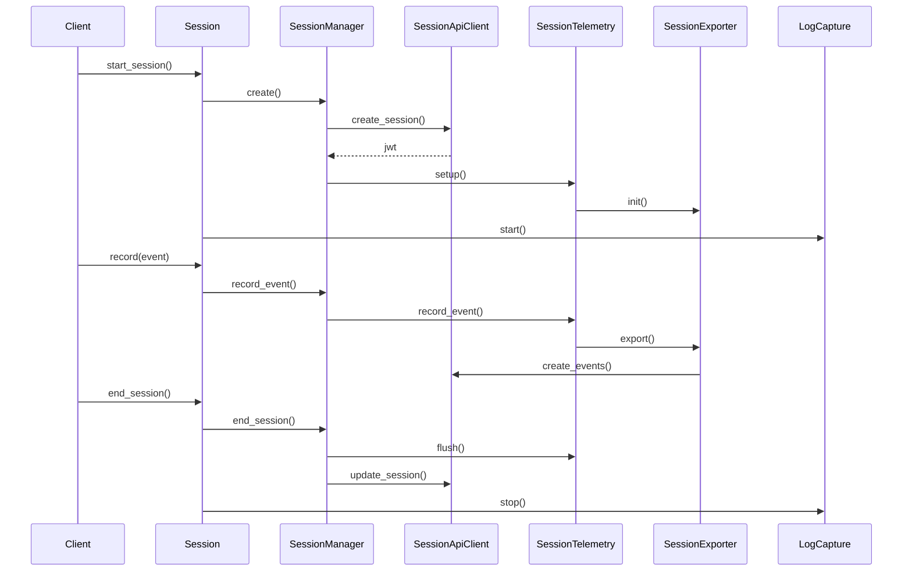

# Session Package

This package contains the core session management functionality for AgentOps.

## Architecture



## Component Responsibilities

### Session (`session.py`)
- Data container for session state
- Provides public API for session operations
- Delegates all operations to SessionManager
- Manages log capture setup/teardown
- Handles session configuration
- Supports session inheritance
- Manages session analytics

### SessionManager (`manager.py`)
- Handles session lifecycle and state management
- Coordinates between API, telemetry, and registry
- Manages session analytics and event counts
- Handles tag management
- Creates and tracks agents
- Manages session end states
- Formats and logs analytics

### SessionApiClient (`api.py`)
- Handles all HTTP communication with AgentOps API
- Manages authentication headers and JWT
- Serializes session state for API calls
- Handles agent creation
- Manages event batching
- Implements retry logic

### SessionTelemetry (`telemetry.py`)
- Sets up OpenTelemetry infrastructure
- Records events with proper context
- Manages event batching and flushing
- Configures span processors
- Handles event serialization
- Supports forced flushing

### SessionExporter (`../telemetry/exporters/session.py`)
- Exports OpenTelemetry spans as AgentOps events
- Handles event formatting and delivery
- Manages export batching and retries
- Implements timeout handling

### Registry (`registry.py`)
- Tracks active sessions
- Provides global session access
- Maintains backward compatibility with old code
- Supports multiple concurrent sessions

### LogCapture (`log_capture.py`)
- Captures stdout/stderr using OpenTelemetry logging
- Integrates with SessionTelemetry for consistent configuration
- Manages log buffering and export
- Supports start/stop/flush operations
- Handles multi-threaded output
- Preserves output formatting

## Data Flow



## Usage Example

```python
from agentops import Client

# Create client
client = Client(api_key="your-key")

# Start session with configuration
session = client.start_session(
    tags=["test"],
    auto_start_session=True,
    skip_auto_end_session=False
)

# Record events
session.record(some_event)

# Add/set tags
session.add_tags(["new_tag"])
session.set_tags(["replacement_tag"])

# Create agent
agent_id = session.create_agent("agent_name")

# Get analytics
stats = session.get_analytics()

# End session with state
session.end_session(
    end_state="Success",
    end_state_reason="Task completed",
    video="https://recording.url"
)
```
