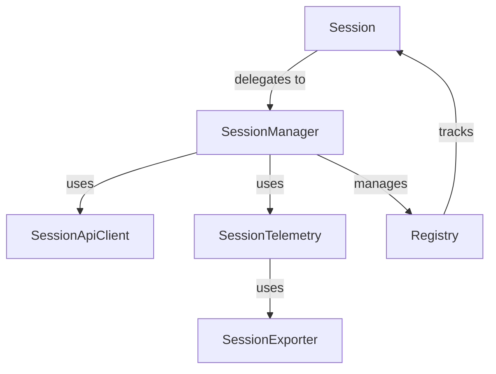
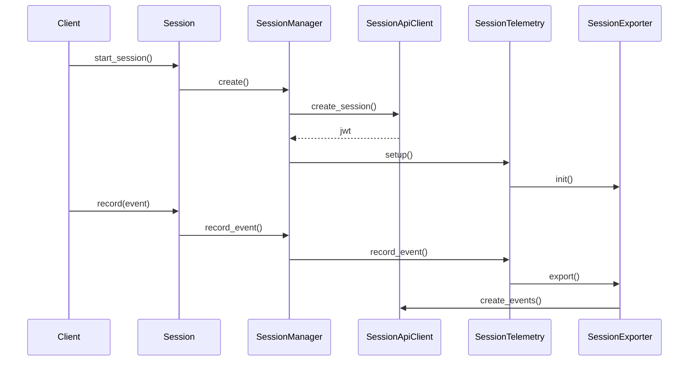

# Session Package

This package contains the core session management functionality for AgentOps.

## Architecture



## Component Responsibilities

### Session (`session.py`)
- Data container for session state
- Provides public API for session operations
- Delegates all operations to SessionManager

### SessionManager (`manager.py`)
- Handles session lifecycle and state management
- Coordinates between API, telemetry, and registry
- Manages session analytics and event counts

### SessionApiClient (`api.py`)
- Handles all HTTP communication with AgentOps API
- Manages authentication headers and JWT
- Serializes session state for API calls

### SessionTelemetry (`telemetry.py`)
- Sets up OpenTelemetry infrastructure
- Records events with proper context
- Manages event batching and flushing

### SessionExporter (`../telemetry/exporters/session.py`)
- Exports OpenTelemetry spans as AgentOps events
- Handles event formatting and delivery
- Manages export batching and retries

### Registry (`registry.py`)
- Tracks active sessions
- Provides global session access
- Maintains backward compatibility with old code

## Data Flow



## Usage Example

```python
from agentops import Client

# Create client
client = Client(api_key="your-key")

# Start session
session = client.start_session(tags=["test"])

# Record events
session.record(some_event)

# Add tags
session.add_tags(["new_tag"])

# End session
session.end_session(end_state="Success")
```
