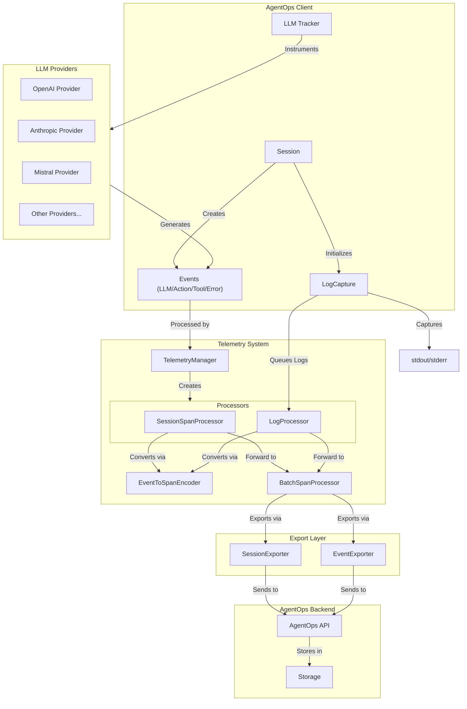

```mermaid
flowchart TB
    subgraph Client["AgentOps Client"]
        Session["Session"]
        Events["Events (LLM/Action/Tool/Error)"]
        LLMTracker["LLM Tracker"]
        LogCapture["LogCapture"]
    end

    subgraph Providers["LLM Providers"]
        OpenAI["OpenAI Provider"]
        Anthropic["Anthropic Provider"]
        Mistral["Mistral Provider"]
        Other["Other Providers..."]
    end

    subgraph TelemetrySystem["Telemetry System"]
        TelemetryManager["TelemetryManager"]
        
        subgraph Processors["Processors"]
            SessionSpanProcessor["SessionSpanProcessor"]
            LogProcessor["LogProcessor"]
        end
        
        SpanEncoder["EventToSpanEncoder"]
        BatchProcessor["BatchSpanProcessor"]
    end

    subgraph Export["Export Layer"]
        SessionExporter["SessionExporter"]
        EventExporter["EventExporter"]
    end

    subgraph Backend["AgentOps Backend"]
        API["AgentOps API"]
        Storage["Storage"]
    end

    %% Flow connections
    Session -->|Creates| Events
    Session -->|Initializes| LogCapture
    LogCapture -->|Captures| StdOut["stdout/stderr"]
    LogCapture -->|Queues Logs| LogProcessor
    
    LLMTracker -->|Instruments| Providers
    Providers -->|Generates| Events
    Events -->|Processed by| TelemetryManager
    
    TelemetryManager -->|Creates| Processors
    SessionSpanProcessor -->|Converts via| SpanEncoder
    LogProcessor -->|Converts via| SpanEncoder
    SessionSpanProcessor & LogProcessor -->|Forward to| BatchProcessor
    
    BatchProcessor -->|Exports via| SessionExporter
    BatchProcessor -->|Exports via| EventExporter
    
    SessionExporter -->|Sends to| API
    EventExporter -->|Sends to| API
    API -->|Stores in| Storage
```
