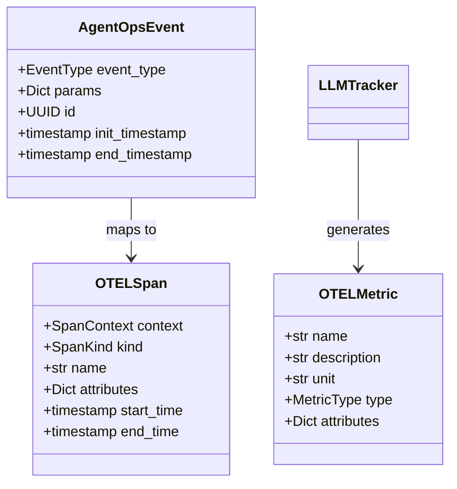
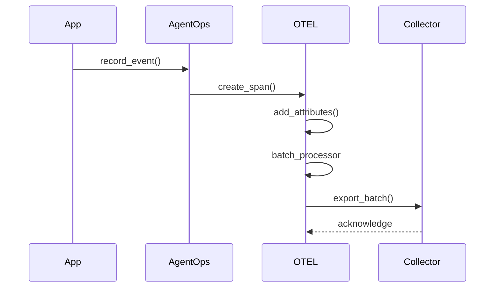
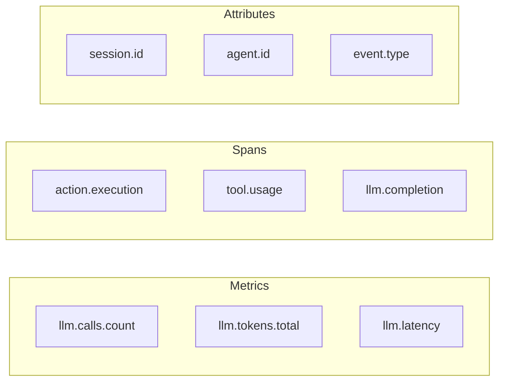

# AgentOps OpenTelemetry Integration

## Architecture Overview

```mermaid
flowchart TB
    subgraph AgentOps
        Client[AgentOps Client]
        Session[Session]
        Events[Events]
        LLMTracker[LLM Tracker]
    end

    subgraph OpenTelemetry
        TracerProvider[Tracer Provider]
        MeterProvider[Meter Provider]
        Processors[Span/Metric Processors]
        OTLP[OTLP Exporters]
    end

    subgraph Backends
        Collector[OTEL Collector]
        Backends[Observability Backends]
    end

    Client --> Session
    Session --> Events
    Client --> LLMTracker

    %% OTEL Integration Points
    Events --> TracerProvider
    LLMTracker --> MeterProvider
    TracerProvider --> Processors
    MeterProvider --> Processors
    Processors --> OTLP
    OTLP --> Collector
    Collector --> Backends
```

## Component Mapping



## Data Flow



## Implementation Guide

1. **Resource Configuration**
```python
from opentelemetry.sdk.resources import Resource, SERVICE_NAME

resource = Resource(attributes={
    SERVICE_NAME: "agentops",
    "library.name": "agentops",
    "library.version": "1.0.0"
})
```

2. **Tracer Setup**
```python
from opentelemetry.sdk.trace import TracerProvider
from opentelemetry.sdk.trace.export import BatchSpanProcessor
from opentelemetry.exporter.otlp.proto.grpc.trace_exporter import OTLPSpanExporter

tracer_provider = TracerProvider(resource=resource)
otlp_exporter = OTLPSpanExporter(endpoint="<collector-endpoint>")
span_processor = BatchSpanProcessor(otlp_exporter)
tracer_provider.add_span_processor(span_processor)
```

3. **Metrics Setup**
```python
from opentelemetry.sdk.metrics import MeterProvider
from opentelemetry.sdk.metrics.export import PeriodicExportingMetricReader
from opentelemetry.exporter.otlp.proto.grpc.metric_exporter import OTLPMetricExporter

metric_reader = PeriodicExportingMetricReader(
    OTLPMetricExporter(endpoint="<collector-endpoint>")
)
meter_provider = MeterProvider(
    resource=resource,
    metric_readers=[metric_reader]
)
```

## Key Metrics & Spans



## Best Practices

1. **Resource Attribution**
   - Always set service name and version
   - Include environment information
   - Add deployment-specific tags

2. **Span Management**
   - Use context managers for automatic span lifecycle
   - Add error handling and status codes
   - Include relevant attributes for filtering

3. **Metric Collection**
   - Use appropriate metric types (counter, histogram, gauge)
   - Add dimension tags for better querying
   - Configure appropriate aggregation intervals

4. **Performance**
   - Use batch processors for spans and metrics
   - Configure appropriate batch sizes and export intervals
   - Enable sampling for high-volume deployments

Would you like me to elaborate on any specific aspect of this integration architecture?
