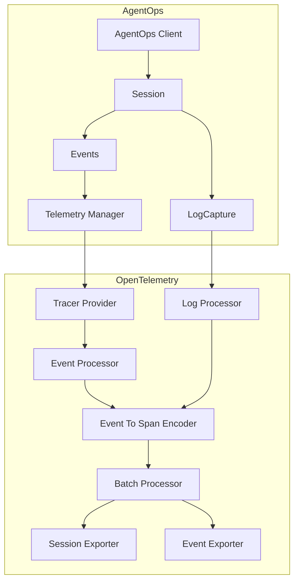

# AgentOps OpenTelemetry Integration

## Architecture Overview



## Component Overview

### TelemetryManager (`manager.py`)
- Central configuration and management of OpenTelemetry setup
- Handles TracerProvider lifecycle and sampling configuration
- Manages session-specific exporters and processors
- Coordinates telemetry initialization and shutdown
- Configures logging telemetry

### SessionSpanProcessor (`processors.py`)
- Processes spans for AgentOps events
- Adds session context to spans
- Tracks event counts by type
- Handles error propagation
- Forwards spans to wrapped processor

### SessionExporter & EventExporter (`exporters/`)
- Exports session spans and events
- Implements retry logic with exponential backoff
- Supports custom formatters
- Handles batched export
- Manages error handling and recovery

### EventToSpanEncoder (`encoders.py`)
- Converts AgentOps events into OpenTelemetry spans
- Handles different event types (LLM, Action, Tool, Error)
- Maintains proper span relationships
- Supports custom attribute mapping

## Configuration Options

The `OTELConfig` class supports:
```python
@dataclass
class OTELConfig:
    additional_exporters: Optional[List[SpanExporter]] = None
    resource_attributes: Optional[Dict] = None
    sampler: Optional[Sampler] = None
    retry_config: Optional[Dict] = None
    custom_formatters: Optional[List[Callable]] = None
    enable_metrics: bool = False
    metric_readers: Optional[List] = None
    max_queue_size: int = 512
    max_export_batch_size: int = 256
    max_wait_time: int = 5000
    endpoint: str = "https://api.agentops.ai"
    api_key: Optional[str] = None
```

## Usage Example

```python
from agentops.telemetry import OTELConfig, TelemetryManager

# Configure telemetry with retry and custom formatting
config = OTELConfig(
    endpoint="https://api.agentops.ai",
    api_key="your-api-key",
    retry_config={
        "retry_count": 3,
        "retry_delay": 1.0
    },
    custom_formatters=[your_formatter_function],
    enable_metrics=True
)

# Initialize telemetry manager
manager = TelemetryManager()
manager.initialize(config)

# Create session tracer
tracer = manager.create_session_tracer(
    session_id=session_id,
    jwt=jwt_token
)
```
