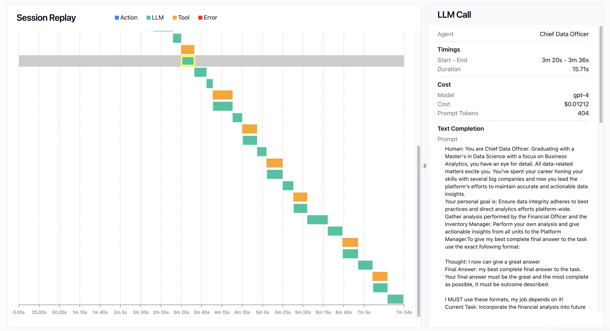

# AgentOps + Mistral Integration

[AgentOps](https://agentops.ai) provides monitoring and observability for LLM applications. This integration demonstrates how to monitor and analyze Mistral model runs using AgentOps.


## Features
- Real-time monitoring of Mistral model calls
- Session waterfall visualization for tracking model interactions
- Detailed event tracking and performance metrics
- Agent-based monitoring with custom tags and metadata
- Comprehensive analytics dashboard for model behavior analysis

## Installation

Install the required packages:

```bash
pip install agentops mistralai
```

## Usage

Initialize AgentOps and Mistral:

```python
from mistralai import Mistral
import agentops

# Initialize clients
agentops.init("<AGENTOPS_API_KEY>")
client = Mistral("<MISTRAL_API_KEY>")
```

Track model interactions with agent decorators:

```python
@agentops.track_agent(name='mistral-agent')
def get_completion(prompt):
    response = client.chat.complete(
        model="mistral-small-latest",
        messages=[{"role": "user", "content": prompt}]
    )
    return response.choices[0].message.content

# Example usage
response = get_completion("Explain quantum computing")
```

See the [notebook](./monitoring_mistral.ipynb) for more detailed examples including:
- Streaming responses
- Async operations
- Custom event tracking
- Performance monitoring

## Results

### Session Waterfall
Track the timing and dependencies of your model calls:



### Performance Analytics
Monitor your model's performance and behavior over time:


## Learn More
- [AgentOps Documentation](https://docs.agentops.ai)
- [Mistral API Documentation](https://docs.mistral.ai)
- [Example Notebook](./monitoring_mistral.ipynb)
