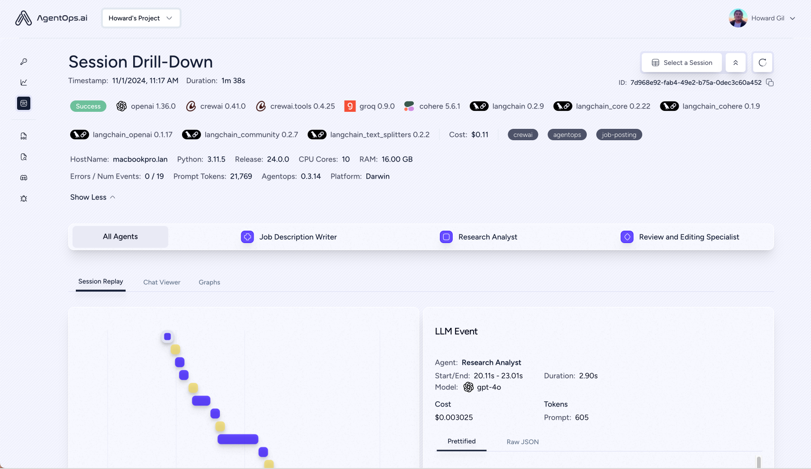

# AgentOps Monitoring for Mistral AI


## What is AgentOps?
AgentOps is a comprehensive observability platform for LLM applications, providing real-time monitoring, debugging, and performance analytics for AI agents. With AgentOps, you can track model interactions, analyze performance metrics, and optimize your AI applications with ease.

## Why Monitor Mistral AI Models?
- Real-time performance tracking and latency analysis
- Cost optimization and token usage monitoring
- Error detection and debugging capabilities
- Session replay for understanding model behavior
- Comprehensive analytics dashboard
- Custom event tracking and metadata analysis

## Installation

```bash
pip install agentops mistralai
```

## Integration Examples

### Basic Model Monitoring
Track your Mistral model calls with detailed performance metrics:

```python
from mistralai import Mistral
import agentops

# Initialize clients
agentops.init("<AGENTOPS_API_KEY>")
client = Mistral("<MISTRAL_API_KEY>")

@agentops.track_agent(name='mistral-agent')
def get_completion(prompt):
    response = client.chat.complete(
        model="mistral-small-latest",
        messages=[{"role": "user", "content": prompt}]
    )
    return response.choices[0].message.content

# Example usage
response = get_completion("Explain quantum computing")
```

See our [example notebook](./monitoring_mistral.ipynb) for more advanced examples including:
- Streaming responses with real-time monitoring
- Async operations and parallel request tracking
- Custom event tracking and metadata analysis
- Performance optimization techniques
- Error handling and debugging strategies

## Visual Examples

### Session Overview
Monitor your model's performance and behavior in real-time:



### Session Replay
Analyze the flow and dependencies of your model interactions:


### Detailed Analytics
Track performance metrics and model behavior:


## Learn More
- [AgentOps Documentation](https://docs.agentops.ai)
- [Mistral API Documentation](https://docs.mistral.ai)
- [Example Notebook](./monitoring_mistral.ipynb)
- [Join our Discord Community](https://discord.gg/agentops)
