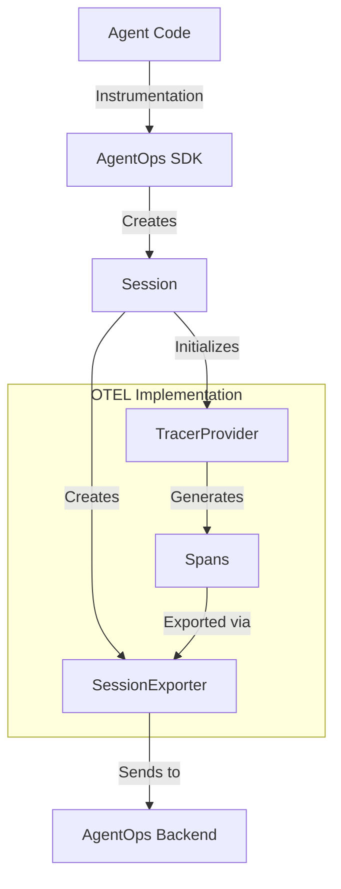

# OpenTelemetry Design in AgentOps

## Overview

AgentOps uses OpenTelemetry (OTEL) for its observability infrastructure. The implementation centers around a custom SessionExporter that handles the export of telemetry data to the AgentOps backend.

## Core Components

### 1. Session Exporter
The SessionExporter is the primary component responsible for exporting spans to the AgentOps backend.

```python
class SessionExporter(SpanExporter):
    def __init__(self, session, endpoint: str):
        self._export_lock = threading.Lock()
        self._shutdown = threading.Event()
        self.session = session
        self.endpoint = endpoint

    def export(self, spans: Sequence[ReadableSpan]) -> SpanExportResult:
        # Implementation details in session.py
```

### 2. Session Management

Sessions are the core organizational unit in AgentOps. Each session maintains its own OTEL context and exporter.

Key attributes:
```python
class Session:
    def __init__(self):
        self.session_id: UUID
        self._tracer_provider: TracerProvider
        self._otel_exporter: SessionExporter
```

## Architecture



## Span Structure

Each span represents an event in AgentOps and contains the following required attributes:

```python
{
    "event.id": str(UUID),
    "event.type": str,
    "event.timestamp": str,  # ISO format
    "event.end_timestamp": str,  # ISO format
    "event.data": str,  # JSON serialized
    "session.id": str
}
```

## Implementation Details

### 1. Span Export Process

The export process follows these steps:

1. Collect spans in batch
2. Format event data based on event type (actions, tools, etc.)
3. Add required timestamps and IDs
4. Export to AgentOps backend via HTTP

### 2. Session States

AgentOps supports two session management modes:

1. Single Session Mode
   - One active session at a time
   - Synchronous operations
   - Default mode

2. Multi-Session Mode
   - Multiple concurrent sessions
   - Asynchronous operations
   - Requires explicit session management

## Best Practices

1. **Session Management**
   - Initialize sessions explicitly
   - End sessions properly
   - Handle session state transitions

2. **Span Creation**
   - Include all required attributes
   - Use consistent event types
   - Properly format timestamps

3. **Error Handling**
   - Implement proper retry logic
   - Log export failures
   - Maintain data consistency

## Configuration Options

The OTEL implementation can be configured through:

1. **Export Settings**
   - Batch size
   - Export frequency
   - Retry attempts

2. **Instrumentation Options**
   - Auto-instrumentation toggles
   - Custom attribute addition
   - Sampling rates

## Future Improvements

1. **Distributed Tracing**
   - Cross-service trace context propagation
   - Baggage support
   - W3C trace context compliance

2. **Metrics Collection**
   - OTEL metrics support
   - Custom metrics exporters
   - Aggregation support

3. **Performance Optimization**
   - Batch size optimization
   - Export frequency tuning
   - Compression support