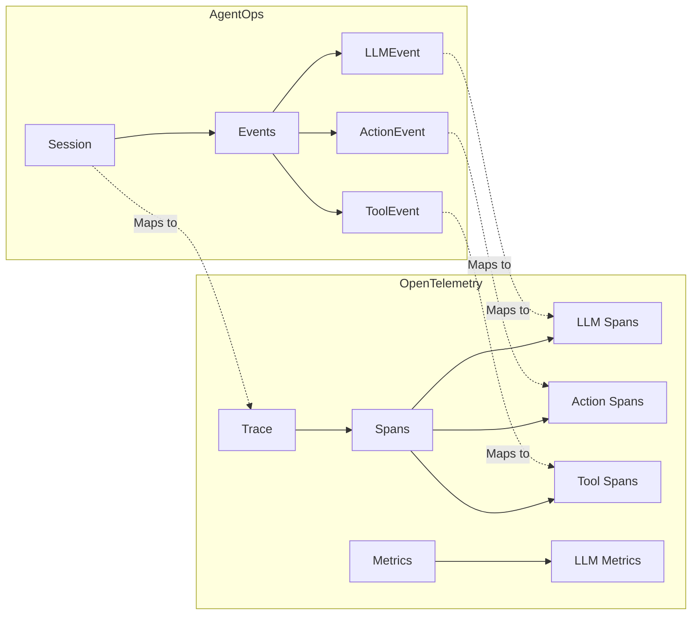

An example of how AgentOps components could map to OpenTelemetry concepts:

1. **Core Mapping**


Let's look at specific examples:

1. **Session to Trace**
````python
# When AgentOps starts a session:
class Session:
    def __init__(self):
        # Create root span for the session
        self.trace = tracer.start_span(
            name="agentops.session",
            attributes={
                "session.id": self.session_id,
                "agent.id": self.agent_id
            }
        )
````

2. **LLMEvent to Span**
````python
# When AgentOps records an LLM event:
class LLMEvent:
    def to_span(self):
        return tracer.start_span(
            name="llm.completion",
            attributes={
                "llm.model": self.model,
                "llm.tokens.prompt": self.prompt_tokens,
                "llm.tokens.completion": self.completion_tokens,
                "llm.cost": self.cost
            }
        )
````

3. **LLM Metrics**
````python
# In LlmTracker:
class LlmTracker:
    def __init__(self):
        self.calls_counter = meter.create_counter(
            name="llm.calls",
            description="Number of LLM API calls"
        )
        
        self.token_histogram = meter.create_histogram(
            name="llm.tokens",
            description="Distribution of token usage"
        )
````
