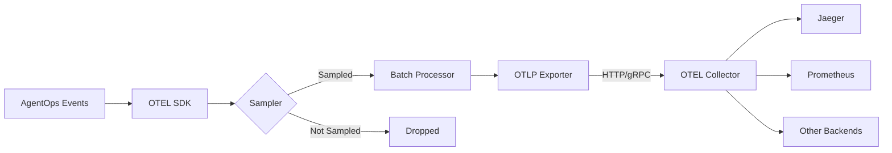
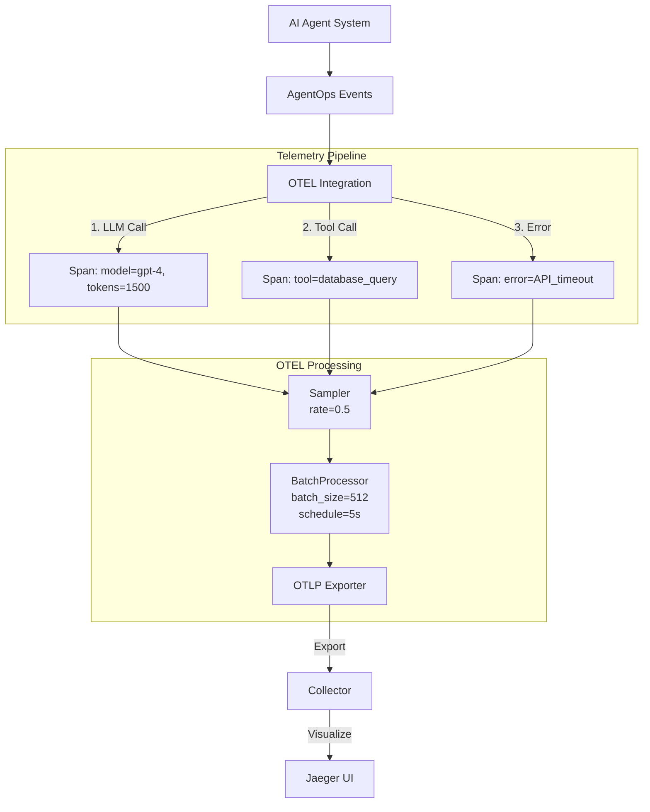

Based on the documentation, here's a high-level overview of exporters behavior and a real-world use case:

### Exporters Behavior



### Real-World Use Case Example:



Key Behaviors:

1. **Sampling Decision**:
- Parent-based sampling ensures entire traces are sampled consistently
- Error events typically have higher sampling priority
- Default sampling rate can be configured (e.g., 0.5 = 50% of traces)

2. **Batching**:
```python
# Example configuration
batch_processor = BatchSpanProcessor(
    OTLPSpanExporter(),
    # Max batch size before forcing export
    max_queue_size=512,
    # Scheduled export interval
    schedule_delay_millis=5000
)
```

3. **Export Formats**:
```python
# OTLP over gRPC (recommended for production)
otlp_exporter = OTLPSpanExporter(
    endpoint="https://collector:4317",
    insecure=False
)

# Console exporter (for development)
console_exporter = ConsoleSpanExporter()
```

This setup allows AgentOps to:
- Efficiently batch and export telemetry data
- Maintain trace context across agent operations
- Control data volume through sampling
- Support multiple observability backends through the collector
