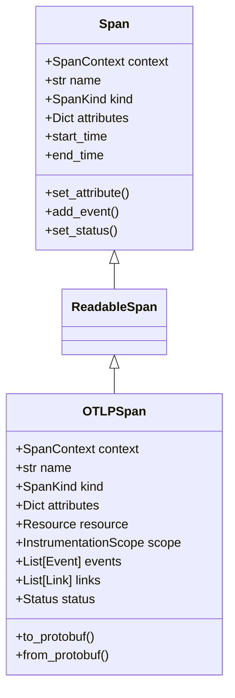

### Span vs OTLPSpan



1. **Span (Base Class)**
   - Basic span representation for in-memory operations
   - Used during active tracing
   - Contains core attributes and methods
   ```python
   from opentelemetry.trace import Span
   
   span = tracer.start_span("operation_name")
   span.set_attribute("key", "value")
   ```

2. **OTLPSpan (OTLP Format)**
   - Specialized format for OpenTelemetry Protocol (OTLP)
   - Used for exporting/transmitting spans
   - Contains additional fields for interoperability
   - Includes protobuf serialization capabilities
   ```python
   from opentelemetry.exporter.otlp.proto.grpc.trace_exporter import OTLPSpanExporter
   
   # Spans are automatically converted to OTLP format during export
   exporter = OTLPSpanExporter()
   ```

3. **Key Differences**:
   ```python
   # Regular Span - Used in instrumentation
   with tracer.start_span("my_operation") as span:
       span.set_attribute("custom.attribute", "value")
       # ... do work ...
   
   # OTLPSpan - Used in export pipeline
   class CustomExporter(SpanExporter):
       def export(self, spans: Sequence[ReadableSpan]) -> SpanExportResult:
           # Spans are converted to OTLP format here
           otlp_spans = [span.to_otlp() for span in spans]
           # Send to backend...
   ```

The main distinction is that `Span` is used for instrumentation while `OTLPSpan` is used for data exchange between systems.
