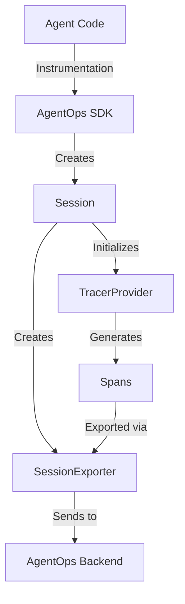
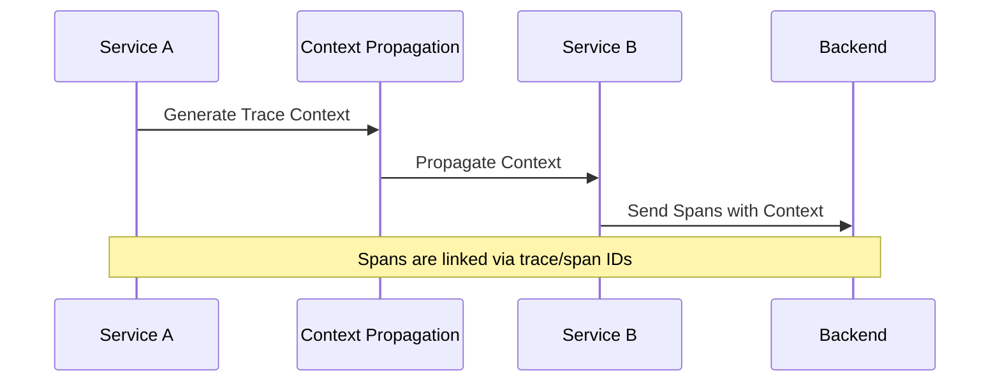

Based on the OpenTelemetry Python documentation and the current codebase, I'll explain these concepts and provide recommendations for implementation:

# OpenTelemetry Design in AgentOps

## Current Implementation

AgentOps uses OpenTelemetry for observability through a custom SessionExporter that handles span export and session management.



## Distributed Tracing

### Current State
Currently, AgentOps implements basic tracing within a single service. To support distributed tracing across services:



### Implementation Plan

1. **Cross-Service Trace Context Propagation**
```python
from opentelemetry.propagate import inject, extract
from opentelemetry.trace import get_current_span

class DistributedSession(Session):
    def propagate_context(self, headers=None):
        if headers is None:
            headers = {}
        inject(headers)  # Injects current context into headers
        return headers

    def receive_context(self, headers):
        context = extract(headers)
        return context
```

2. **Baggage Support**
```python
from opentelemetry.baggage import set_baggage, get_baggage

class Session:
    def add_baggage(self, key: str, value: str):
        """Add metadata that flows with the trace"""
        set_baggage(key, value)
    
    def get_baggage_value(self, key: str) -> str:
        """Retrieve baggage value"""
        return get_baggage(key)
```

3. **W3C Trace Context Compliance**
```python
from opentelemetry.propagators.trace_context import TraceContextTextMapPropagator

class Session:
    def __init__(self):
        self.propagator = TraceContextTextMapPropagator()
        # Use W3C trace context format
        set_global_textmap(self.propagator)
```

## Metrics Implementation

### Custom Metrics
```python
from opentelemetry import metrics
from opentelemetry.sdk.metrics import MeterProvider
from opentelemetry.sdk.metrics.export import PeriodicExportingMetricReader
from opentelemetry.exporter.otlp.proto.http.metric_exporter import OTLPMetricExporter

class MetricsManager:
    def __init__(self):
        # Configure metrics export
        reader = PeriodicExportingMetricReader(
            OTLPMetricExporter(endpoint="<your-endpoint>")
        )
        provider = MeterProvider(metric_readers=[reader])
        metrics.set_meter_provider(provider)
        self.meter = metrics.get_meter("agentops.metrics")
        
        # Define custom metrics
        self.llm_latency = self.meter.create_histogram(
            name="llm.request.latency",
            description="Time taken for LLM requests"
        )
        
        self.token_counter = self.meter.create_counter(
            name="llm.tokens.total",
            description="Total tokens processed"
        )

    def record_latency(self, duration_ms: float):
        self.llm_latency.record(duration_ms)

    def increment_tokens(self, count: int):
        self.token_counter.add(count)
```

### Integration with Session

```python
class Session:
    def __init__(self):
        self.metrics = MetricsManager()
        
    def record_llm_call(self, duration_ms: float, token_count: int):
        self.metrics.record_latency(duration_ms)
        self.metrics.increment_tokens(token_count)
```

## Configuration

```python
# Environment variables for metrics configuration
OTEL_EXPORTER_OTLP_METRICS_ENDPOINT="http://collector:4318/v1/metrics"
OTEL_EXPORTER_METRICS_TEMPORALITY_PREFERENCE="DELTA"

# Metrics export interval
OTEL_METRIC_EXPORT_INTERVAL=60000  # milliseconds
```

## Best Practices

1. **Context Propagation**
   - Always propagate trace context in distributed systems
   - Use baggage for request-scoped metadata
   - Follow W3C trace context specification

2. **Metrics**
   - Use appropriate metric types (Counter, Histogram, Gauge)
   - Set meaningful metric names and descriptions
   - Configure appropriate export intervals

3. **Resource Attribution**
   - Tag metrics and traces with service name
   - Include version information
   - Add environment labels
```

This design document outlines both the current implementation and future enhancements for distributed tracing and metrics in AgentOps using OpenTelemetry. The implementation details are based on OpenTelemetry Python best practices and can be extended based on specific needs.
