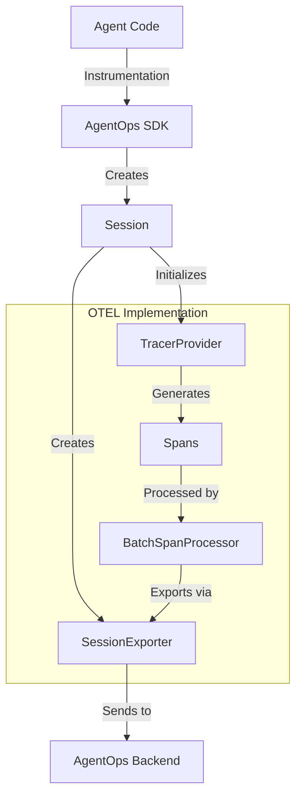
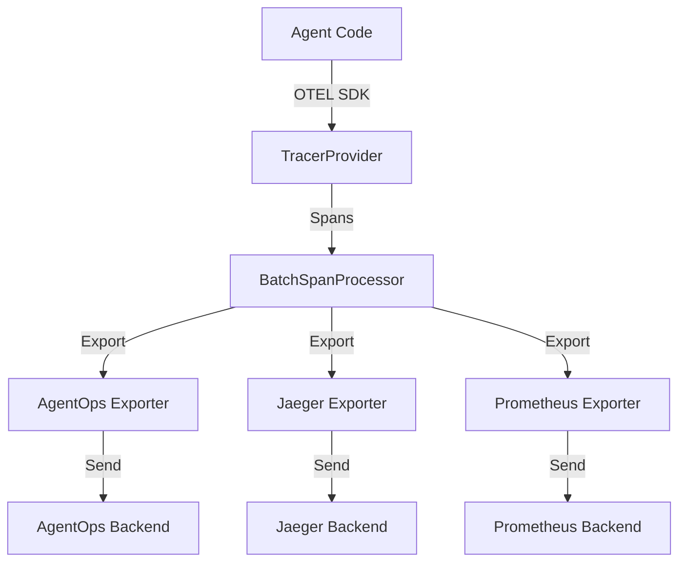

# OpenTelemetry Integration Design in AgentOps

## Current Architecture

AgentOps uses OpenTelemetry (OTEL) as its core instrumentation layer, primarily through a custom `SessionExporter` that handles the export of telemetry data.



## Key Components

### 1. Session Management with OTEL
```python
class Session:
    def __init__(self):
        # Initialize OTEL components per session
        self._tracer_provider = TracerProvider()
        self._otel_exporter = SessionExporter(self, endpoint)
        self._span_processor = BatchSpanProcessor(self._otel_exporter)
        self._tracer_provider.add_span_processor(self._span_processor)
```

### 2. Custom Exporter
```python
class SessionExporter(SpanExporter):
    def export(self, spans: Sequence[ReadableSpan]) -> SpanExportResult:
        # Convert OTEL spans to AgentOps events
        # Send to AgentOps backend
```

## Alternative Integration Approaches

### 1. Pluggable Exporters
```python
class Session:
    def set_exporter(self, exporter: SpanExporter):
        """Allow custom OTEL exporters"""
        self._span_processor = BatchSpanProcessor(exporter)
        self._tracer_provider.add_span_processor(self._span_processor)
```

### 2. Multiple Backends


## Integration Options

1. **Direct OTEL Integration**
```python
# Current implementation
agentops.init()  # Uses built-in OTEL setup

# Potential future implementation
agentops.init(
    otel_config={
        "exporters": [CustomExporter(), JaegerExporter()],
        "processors": [CustomProcessor()],
        "resource_attributes": {"service.name": "my-agent"}
    }
)
```

2. **External OTEL Setup**
```python
# Initialize OTEL separately
provider = TracerProvider()
processor = BatchSpanProcessor(OTLPSpanExporter())
provider.add_span_processor(processor)
trace.set_tracer_provider(provider)

# Use AgentOps with existing OTEL setup
agentops.init(use_external_otel=True)
```

## Best Practices

1. **Single TracerProvider**
   - Each Session maintains its own TracerProvider
   - Prevents cross-contamination between sessions
   - Allows for session-specific configuration

2. **Resource Attribution**
   - All spans include session ID
   - Events are properly linked with trace context
   - Custom attributes for filtering/querying

3. **Flexible Export**
   - Support for multiple export destinations
   - Configurable batch sizes and export intervals
   - Error handling and retry logic

## Future Improvements

1. **Pluggable Architecture**
```python
class OTELPlugin:
    def configure_tracer(self):
        pass
    
    def configure_exporter(self):
        pass

agentops.init(otel_plugin=CustomOTELPlugin())
```

2. **Advanced Sampling**
```python
class CustomSampler(Sampler):
    def should_sample(self, context):
        # Custom sampling logic
        pass

agentops.init(sampler=CustomSampler())
```

3. **Context Propagation**
```python
# Support for distributed tracing
context = agentops.get_current_context()
headers = {}
inject(context, headers)
```

This design shows how OTEL is currently integrated and provides a roadmap for making it more pluggable. The key is that while AgentOps currently uses OTEL internally for its own telemetry needs, the architecture could be extended to allow users to:

1. Use their own OTEL configuration
2. Export to multiple backends simultaneously  
3. Customize sampling and processing
4. Integrate with existing OTEL setups

The mermaid diagrams help visualize both the current implementation and potential future architectures with multiple export paths.
