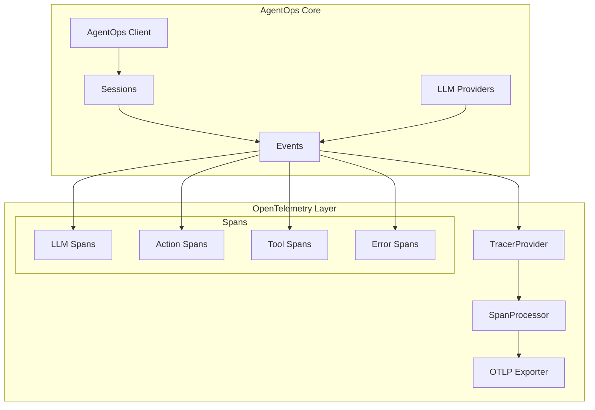

# OpenTelemetry Integration Proposal

## Current Architecture Context

Our current architecture (from CODEBASE.md) shows we have:
- Client as central orchestrator
- Sessions managing discrete periods of activity
- Events (LLM, Action, Tool, Error) capturing agent behavior
- Provider-specific LLM instrumentation
- MetaClient for exception handling

## Proposed OTEL Integration

Here's how OpenTelemetry components map to our existing architecture:



### Entity Mapping

1. **Events to Spans**
```python
# Direct mapping of our events to OTEL spans
EVENT_TO_SPAN_MAPPING = {
    'LLMEvent': {
        'name': 'llm.completion',
        'attributes': {
            'llm.model': 'model',
            'llm.tokens.prompt': 'prompt_tokens',
            'llm.tokens.completion': 'completion_tokens',
            'llm.cost': 'cost'
        }
    },
    'ActionEvent': {
        'name': 'agent.action',
        'attributes': {
            'action.type': 'action_type',
            'action.name': 'name'
        }
    },
    'ToolEvent': {
        'name': 'agent.tool',
        'attributes': {
            'tool.name': 'name'
        }
    },
    'ErrorEvent': {
        'name': 'agent.error',
        'attributes': {
            'error.type': 'error_type',
            'error.code': 'code'
        }
    }
}
```

### Integration Points

1. **Session Management**
```python
class Session:
    def __init__(self):
        self._tracer = get_tracer(__name__)
        self._current_span = None
        
    def start_session(self):
        self._current_span = self._tracer.start_span(
            name="agent.session",
            attributes={
                "session.id": self.session_id,
                "agent.id": self.agent_id
            }
        )
        
    def end_session(self):
        if self._current_span:
            self._current_span.end()
```

2. **Event Recording**
```python
class Session:
    def record(self, event: Event):
        # Create child span for event
        with self._tracer.start_span(
            name=EVENT_TO_SPAN_MAPPING[event.__class__.__name__]['name'],
            attributes=self._map_event_attributes(event),
            context=self._current_span
        ) as span:
            # Existing event recording logic
            self.events.append(event)
            span.set_status(Status(StatusCode.OK))
```

3. **LLM Provider Instrumentation**
```python
class InstrumentedProvider:
    def handle_response(self, response):
        with self._tracer.start_span(
            name="llm.api.call",
            attributes={
                "llm.provider": self.provider_name,
                "llm.model": response.model
            }
        ) as span:
            # Existing response handling
            span.set_status(Status(StatusCode.OK))
```

### Configuration

```python
def initialize_telemetry():
    resource = Resource.create({
        "service.name": "agentops",
        "service.version": __version__,
        "deployment.environment": get_environment()
    })

    provider = TracerProvider(resource=resource)
    processor = BatchSpanProcessor(
        OTLPSpanExporter(
            endpoint=OTLP_ENDPOINT,
            headers={"api-key": API_KEY}
        )
    )
    provider.add_span_processor(processor)
    set_tracer_provider(provider)
```

### Benefits

1. **Standardized Observability**
   - Events automatically converted to OTEL spans
   - Standard attributes for better querying
   - Built-in support for distributed tracing

2. **Performance Impact**
   - Batch processing of spans
   - Minimal overhead during agent execution
   - Configurable sampling for high-volume deployments

3. **Compatibility**
   - Works with existing AgentOps events
   - No changes needed to agent code
   - Support for multiple backends (Jaeger, Datadog, etc.)

### Migration Strategy

1. Phase 1: Basic Integration
   - Add OTEL dependencies
   - Implement basic span creation
   - Map core events to spans

2. Phase 2: Enhanced Features
   - Add distributed tracing
   - Implement sampling strategies
   - Add custom metrics

3. Phase 3: Production Readiness
   - Performance optimization
   - Error handling
   - Documentation
