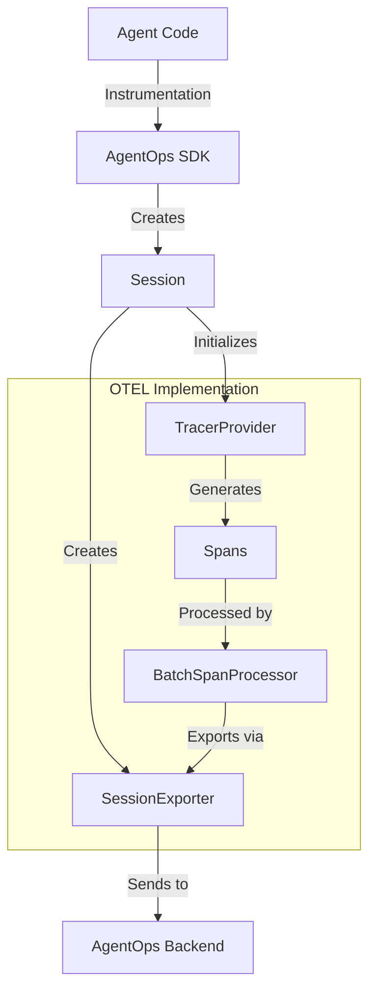
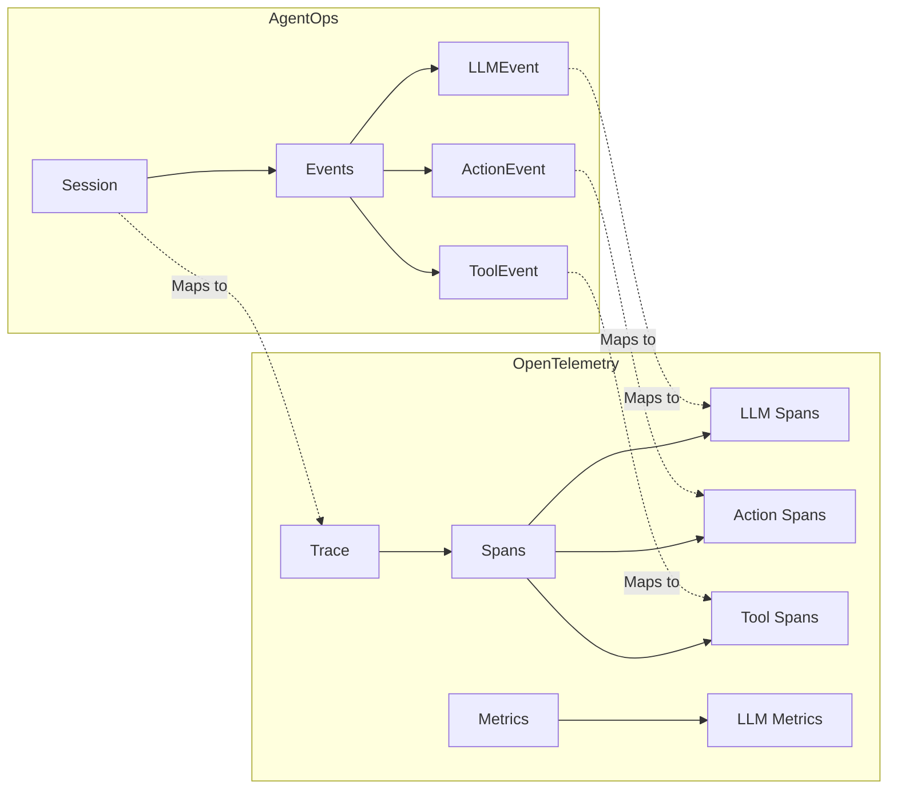

Currently, AgentOps uses OTEL primarily for internal telemetry, primarily handled by [SessionExporter](https://github.com/AgentOps-AI/agentops/blob/fbe476ffe72eb6cd5f7a21c93fdef433ac4b9115/agentops/session.py#L66). You can find more details on the implementation [here](https://github.com/AgentOps-AI/agentops/blob/otel/v2/docs/dev/CURRENT_OTEL.md).

<details><summary>V1 Architecture</summary>

<p>



</p>
</details> 


Which is pretty limited and does not take full advantage of the OpenTelemetry capabilities.

---

Clients might want to:

- **Use Their Own OTEL Setup**
  Many organizations already have OTEL infrastructure and might want to:
    - Send data to multiple backends (their existing + AgentOps)
    - Use their own sampling/batching configurations
    - Add custom attributes/resources

-  **Trace Custom Metrics**
    - LLM-specific metrics (token usage, latency, costs)
    - Agent performance metrics (success rates, completion times)
    - Custom business metrics


---

## Higher-level picture: AgentOps components mapping to OpenTelemetry concepts




1. **Session → Trace**
   - Each session represents a complete interaction/workflow
   - Contains all related events
   - Has a unique `session_id` (that becomes the `trace_id`)

2. **Events → Spans**

    Each Event naturally maps to a span because:
        - Events have start/end times _(like spans)_
        - Events have unique IDs _(like spans)_
        - Events have parameters/metadata _(like span attributes)_
        - Events are hierarchical _(like spans can be)_

<details><summary>Session / Event Tracing</summary>
<p>
    
   ```mermaid
   graph TB
       subgraph Session/Trace
           A[Session Start] -->|Parent Span| B[Events]
           B --> C[LLMEvent<br/>span: llm.completion]
           B --> D[ActionEvent<br/>span: agent.action]
           B --> E[ToolEvent<br/>span: agent.tool]
           
           C --> C1[API Call<br/>span: llm.api.call]
           D --> D1[Function Execution<br/>span: action.execution]
           E --> E1[Tool Execution<br/>span: tool.execution]
       end
   ```
    
</p>
</details> 

[View more details](/AgentOps-AI/agentops/blob/otel/v2/docs/dev/OTEL/entity_mapping.md)
