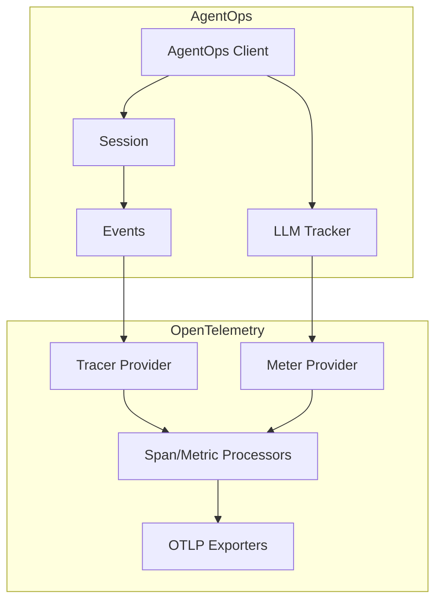
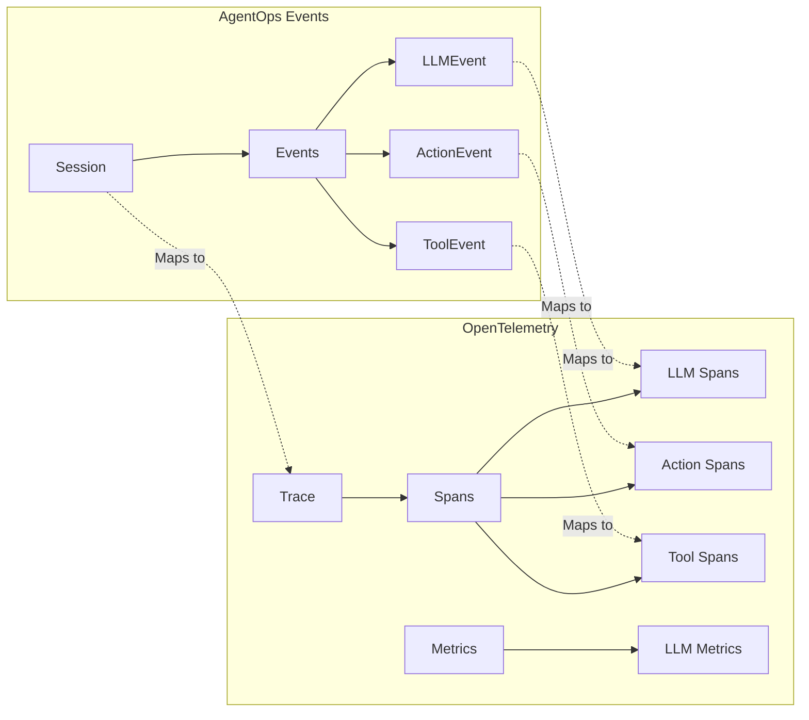
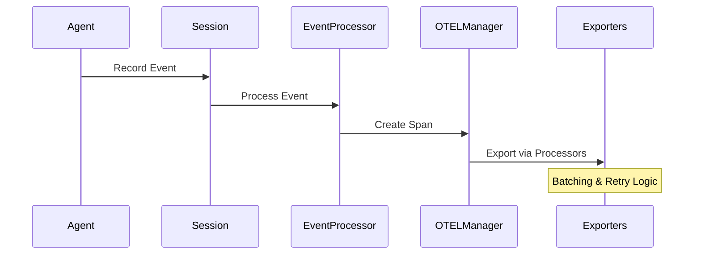

# OpenTelemetry Integration PR

## Core Components

### 1. OTELManager (`manager.py`)
- Central management of OpenTelemetry setup
- Handles TracerProvider configuration
- Manages span processors and exporters
- Resource attribute management
- Sampling configuration

```python
class OTELManager:
    def __init__(self, config: Configuration,
                 exporters: Optional[List[SpanExporter]] = None,
                 resource_attributes: Optional[Dict] = None,
                 sampler: Optional[Sampler] = None)
```

### 2. ExportManager (`exporter.py`)
- Custom span exporter implementation
- Handles batching and retry logic
- Supports custom formatters
- Error handling and recovery

### 3. EventProcessor (`processors.py`)
- Event to span conversion
- Session context management
- Event type handling
- Error event processing

### 4. LiveSpanProcessor (`processors.py`)
- Real-time span monitoring
- In-flight span tracking
- Periodic export of active spans
- Custom attribute injection

## Key Features

1. **Flexible Configuration**
```python
agentops.init(
    api_key="xxx",
    otel_config={
        "additional_exporters": [custom_exporter],
        "resource_attributes": {"service.name": "my-service"},
        "sampler": custom_sampler
    }
)
```

2. **Metrics Support** (`metrics.py`)
- Export attempts/failures tracking
- Duration and batch size histograms
- Memory usage monitoring
- Custom metric support

3. **Logging Integration** (`logging.py`)
- OpenTelemetry-aware logging
- Trace context propagation
- Structured log formatting
- Console export support

## Implementation Details

### Resource Attribution
```python
resource_attributes = {
    SERVICE_NAME: service_name,
    "session.id": session_id,
    # Custom attributes
}
```

### Span Processing Pipeline
1. Event creation
2. Span conversion
3. Processor chain
4. Export handling

### Error Handling
- Retry logic for failed exports
- Error event special handling
- Graceful degradation

## Testing & Validation

1. **Unit Tests**
- Manager configuration
- Export handling
- Processor chain
- Error scenarios

2. **Integration Tests**
- End-to-end flow
- Multiple exporters
- Resource cleanup

## Future Improvements

1. **Distributed Tracing**
- Cross-service context propagation
- W3C trace context support
- Baggage implementation

2. **Advanced Metrics**
- Custom aggregations
- Additional dimensions
- Metric export optimization

3. **Performance**
- Export batching optimization
- Memory usage improvements
- Sampling strategies

## Migration Guide

1. **Basic Usage**
```python
from agentops.telemetry import OTELConfig
config = OTELConfig(enable_metrics=True)
agentops.init(otel_config=config)
```

2. **Custom Configuration**
```python
config = OTELConfig(
    additional_exporters=[my_exporter],
    resource_attributes={"env": "prod"},
    enable_metrics=True
)


# OpenTelemetry Integration PR

## Architecture Overview



## Component Mapping



## Data Flow


