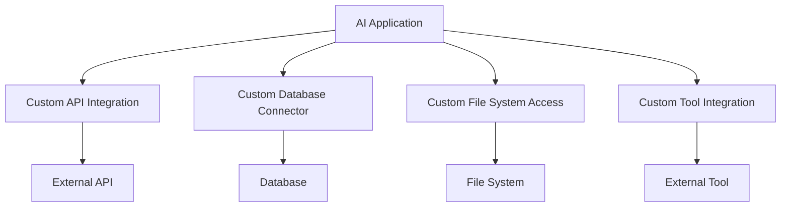
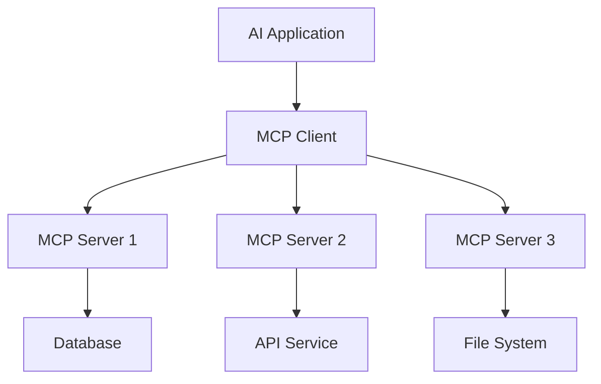
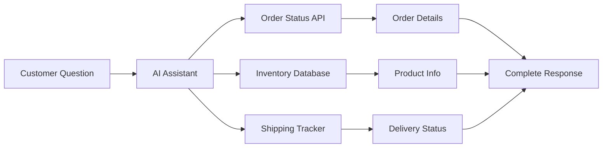
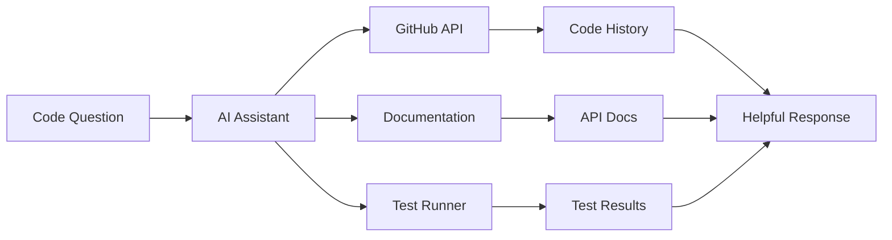

# Model Context Protocol (MCP) Overview

The **Model Context Protocol (MCP)** is an open-source protocol developed by Anthropic that standardizes how AI models connect to external tools, data sources, and context. Think of it as a "universal adapter" that allows AI applications to securely interact with databases, APIs, file systems, and other services without custom integration code.

## Why MCP Matters

### The Integration Problem

Before MCP, every AI application needed custom code to connect to external services:



This approach led to:
- **Fragmentation**: Each tool required unique integration code
- **Maintenance burden**: Updates to APIs broke custom integrations
- **Security risks**: Inconsistent security implementations
- **Vendor lock-in**: Tight coupling between AI apps and specific tools

### The MCP Solution

MCP provides a standardized interface that eliminates the need for custom integrations:



## Core Architecture

MCP follows a client-server architecture with three main components:

### 1. MCP Host
The **Host** is the AI application that needs external capabilities:
- **Claude Desktop**: Anthropic's AI assistant
- **Cursor**: AI-powered code editor
- **Windsurf**: AI development environment
- **Custom applications**: Your own AI-powered tools

### 2. MCP Client
The **Client** acts as a bridge between the host and servers:
- Manages connections to MCP servers
- Handles protocol communication
- Enforces security policies
- Provides user consent flows

### 3. MCP Server
**Servers** expose external capabilities through a standardized interface:
- Database connectors
- API integrations
- File system access
- Custom tools and functions

## MCP Primitives

MCP servers expose three types of capabilities:

### Tools
**Tools** are executable functions that perform actions:

```json
{
  "name": "get_weather",
  "description": "Get current weather for a location",
  "parameters": {
    "type": "object",
    "properties": {
      "location": {
        "type": "string",
        "description": "City name or coordinates"
      }
    }
  }
}
```

Examples:
- API calls (payment processing, data retrieval)
- Database operations (queries, updates)
- File operations (read, write, search)
- System commands (deployment, monitoring)

### Resources
**Resources** provide access to data and content:

```json
{
  "uri": "file:///path/to/document.txt",
  "name": "Project Documentation",
  "description": "Main project documentation file",
  "mimeType": "text/plain"
}
```

Examples:
- File system access
- Database records
- API responses
- Live data streams

### Prompts
**Prompts** are reusable templates that guide AI behavior:

```json
{
  "name": "code_review",
  "description": "Analyze code for potential issues",
  "arguments": [
    {
      "name": "language",
      "description": "Programming language",
      "required": true
    }
  ]
}
```

Examples:
- Code analysis templates
- Writing style guides
- Troubleshooting workflows
- Business process templates

## Communication Protocol

MCP uses JSON-RPC 2.0 for communication over various transports:

### Transport Options
- **stdio**: Local processes communicating via standard input/output
- **HTTP + SSE**: Remote servers using Server-Sent Events
- **WebSocket**: Real-time bidirectional communication

### Message Flow
1. **Initialization**: Client and server negotiate capabilities
2. **Discovery**: Client requests available tools/resources/prompts
3. **Execution**: Client invokes tools or retrieves resources
4. **Response**: Server returns results or error messages

## Security Model

MCP implements several security layers:

### User Consent
- **Explicit approval**: Users must approve each tool execution
- **Parameter visibility**: Users see exactly what data is being sent
- **Cancel capability**: Users can stop operations at any time

### Isolation
- **Server isolation**: Each server runs in its own process
- **Limited scope**: Servers only access explicitly granted resources
- **No cross-server access**: Servers cannot communicate with each other

### Trust Boundaries
- **Trusted hosts**: Only approved applications can use MCP clients
- **Verified servers**: Servers should be from trusted sources
- **Audit trails**: All operations can be logged and monitored

## Benefits of MCP

### For AI Applications
- **Rapid integration**: Connect to new tools without custom code
- **Consistent UX**: Standardized user consent and security flows
- **Reduced maintenance**: Protocol updates benefit all integrations
- **Enhanced capabilities**: Access to a growing ecosystem of tools

### For Tool Providers
- **Broader reach**: One integration works with all MCP clients
- **Standard security**: Built-in security model and user consent
- **Easy distribution**: Servers can be shared via package managers
- **Focus on value**: Spend time on functionality, not protocol details

### For Users
- **More capable AI**: Access to real-time data and actions
- **Better security**: Explicit consent for all operations
- **Consistent experience**: Similar UX across different AI apps
- **Ecosystem growth**: New tools become available to all apps

## Getting Started

### Using MCP as a User
1. **Install MCP-enabled applications** (Claude Desktop, Cursor, etc.)
2. **Add MCP servers** from the community or create your own
3. **Configure permissions** for tools and resources
4. **Start using enhanced AI capabilities**

### Building MCP Servers
1. **Choose your language** (Python, TypeScript, Go, etc.)
2. **Use official SDKs** for rapid development
3. **Implement tools, resources, or prompts**
4. **Test with MCP clients**
5. **Publish for others to use**

## Real-World Examples

### E-commerce Support Bot


### Development Assistant


## The MCP Ecosystem

MCP has gained rapid adoption across the AI industry:

### Client Applications
- **Anthropic**: Claude Desktop and API
- **OpenAI**: ChatGPT and development tools
- **Google**: Vertex AI and Gemini integration
- **Microsoft**: Azure AI and development tools

### Server Implementations
- **Database connectors**: PostgreSQL, MySQL, MongoDB
- **Cloud services**: AWS, Google Cloud, Azure
- **Development tools**: GitHub, GitLab, Jira
- **Business systems**: Salesforce, Slack, email

### Community Resources
- **Official documentation**: [modelcontextprotocol.io](https://modelcontextprotocol.io)
- **SDK repositories**: Multiple languages supported
- **Server marketplace**: Discover and share MCP servers
- **Examples and tutorials**: Learn by doing

## Next Steps

Ready to dive deeper into MCP? Explore these topics:

- **[MCP Integration Guide](./mcp-integration)**: Connect your AI app to MCP servers
- **[Building MCP Servers](./mcp-server-development)**: Create your own MCP servers
- **[MCP Best Practices](./mcp-best-practices)**: Security, performance, and design guidelines

MCP represents a fundamental shift in how AI applications connect to the real world. By standardizing these connections, MCP enables a more capable, secure, and interoperable AI ecosystem.