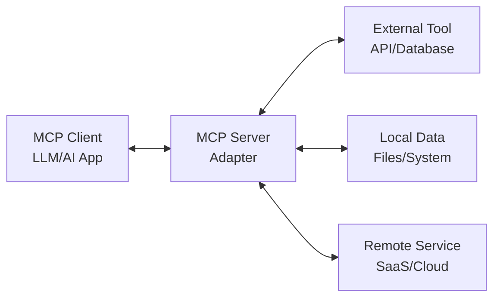

# Model Context Protocol (MCP)

The Model Context Protocol (MCP) is a standardized protocol introduced by Anthropic in November 2024 that revolutionizes how Large Language Models (LLMs) connect to different data sources and tools. It acts as a universal adapter for AI applications, enabling them to interact with external systems in a structured and reliable way.

## What is MCP?

MCP is an open protocol that provides a standardized way for AI applications to:
- Access real-time data from various sources
- Execute actions through external tools and APIs
- Maintain context across interactions
- Share capabilities between different AI systems

Think of MCP as the "HTTP for AI" - just as HTTP standardized how web browsers communicate with servers, MCP standardizes how AI models communicate with external tools and data sources.

## Why MCP Matters

### Before MCP
Previously, when you asked an AI assistant to perform tasks involving external data:
- It relied on web scraping or pre-trained knowledge
- Results were often inaccurate or outdated
- Each integration required custom code
- No standardized way to interact with different services

### With MCP
MCP changes this by providing:
- **Structured Data Access**: Instead of parsing disparate formats, LLMs receive structured responses
- **Two-Way Interaction**: AI can not only read data but also perform actions (with proper permissions)
- **Standardized Integration**: One protocol works across all services
- **Real-Time Accuracy**: Direct access to current data, reducing hallucinations

## How MCP Works

MCP follows a client-server architecture:

### MCP Architecture



### Key Components

#### 1. **MCP Clients**
These are AI applications that use MCP to access external resources:
- Claude Desktop
- Cursor
- Windsurf
- Custom AI applications

#### 2. **MCP Servers**
These act as intermediaries between clients and external tools:
- Translate requests from AI into tool-specific actions
- Handle authentication and permissions
- Return structured data to the AI
- Can be built for any service with an API

#### 3. **Resources**
MCP servers can expose various types of resources:
- **Text content** (documents, code, logs)
- **Structured data** (databases, APIs)
- **Dynamic information** (real-time metrics, live data)

#### 4. **Tools**
Servers can expose executable functions that AI can use:
- Database queries
- API calls
- File operations
- System commands

## MCP in Practice

### Example: Travel Planning Assistant

Let's say a user wants to plan a trip to Mexico City. Here's how MCP enables a better experience:

**Without MCP:**
```
User: "Find hotels in Mexico City for April 15-18"
AI: "Based on my training data, here are some hotels..." 
(Returns potentially outdated or inaccurate information)
```

**With MCP:**
```
User: "Find hotels in Mexico City for April 15-18"
AI: (Connects to hotel booking MCP server)
    (Retrieves real-time availability and prices)
    "I found 23 available hotels. Here are the top options
     with current prices and availability..."
    
User: "Book the second one"
AI: (Executes booking through MCP server)
    "I've reserved your room. Confirmation #ABC123"
```

## Building MCP Servers

Anyone can create an MCP server to integrate their product with AI tools. Here's what you need:

### For Products with APIs
If your product already has an API, you can:
1. Build a custom MCP server that translates MCP requests to your API
2. Use documentation platforms like Mintlify that auto-generate MCP servers
3. Share your server on MCP marketplaces

### For Local Tools
You can create MCP servers that:
- Access local files and databases
- Execute system commands
- Integrate with development tools
- Connect to internal services

## Mintlify's MCP Server Generator

[Mintlify](https://mintlify.com/docs/mcp) provides an innovative solution for companies that want to enable MCP access to their products without building custom servers from scratch.

### How Mintlify Works

Mintlify automatically generates MCP servers for all customers by:
1. **API Documentation**: Converting your OpenAPI spec into MCP-compatible tools
2. **Content Access**: Making your tutorials and documentation searchable via MCP
3. **Zero Configuration**: No custom code required - it works out of the box

### Setting Up Mintlify MCP

For Mintlify customers, the process is simple:

1. **Install the Mintlify MCP package**:
   ```bash
   npm i mcp
   ```

2. **Add your specific docs MCP server**:
   ```bash
   npx mcp add [your-subdomain]
   ```

3. **Use with any MCP client** (Claude Desktop, Cursor, Windsurf, etc.)

### Benefits of Mintlify's Approach

- **Automatic Updates**: Your MCP server updates whenever you update your docs
- **API Integration**: Your OpenAPI endpoints become callable MCP tools
- **Context-Aware Help**: AI can provide real-time answers about your product
- **No Maintenance**: Mintlify handles all the MCP protocol implementation

This makes Mintlify an excellent choice for teams that want to leverage MCP without the engineering overhead of building and maintaining their own servers.

## Benefits of MCP

### For Developers
- **Modular Integration**: Add/remove tools without modifying the AI model
- **Standardized Protocol**: One way to integrate with all AI platforms
- **Broader Reach**: Your tool becomes accessible to any MCP-compatible AI

### For Users
- **Real-Time Data**: Always get current, accurate information
- **Action Capability**: AI can perform tasks, not just provide information
- **Consistent Experience**: Same tools work across different AI platforms
- **Privacy Control**: Choose which data sources AI can access

### For AI Applications
- **Extended Capabilities**: Access any tool or data source
- **Reduced Hallucinations**: Direct data access means fewer made-up responses
- **Contextual Persistence**: Maintain state across interactions
- **Multi-Agent Coordination**: Share context between AI systems

## Common Use Cases

### Enterprise Applications
- **Customer Support**: Access customer history and perform account actions
- **Data Analysis**: Query databases and generate reports
- **Document Processing**: Read, analyze, and update documents

### Developer Tools
- **Code Management**: Access repositories, run tests, deploy code
- **Debugging**: Analyze logs, inspect systems, trace errors
- **Documentation**: Generate and update technical docs

### Personal Productivity
- **Task Management**: Create, update, and track tasks
- **Calendar Integration**: Schedule meetings and manage events
- **File Organization**: Manage and search personal files

## Getting Started with MCP

### Using MCP Servers
1. Choose an MCP-compatible AI client (Claude, Cursor, etc.)
2. Install MCP servers for tools you want to use
3. Configure authentication and permissions
4. Start using AI with enhanced capabilities

### Creating MCP Servers
1. Choose your implementation language (TypeScript, Python, etc.)
2. Implement the MCP protocol specification
3. Define your resources and tools
4. Test with MCP clients
5. Share on MCP marketplaces

## Technical Implementation

### MCP Protocol Basics

MCP uses JSON-RPC 2.0 for communication between clients and servers. Here's a simplified example:

**Client Request:**
```json
{
  "jsonrpc": "2.0",
  "id": 1,
  "method": "tools/call",
  "params": {
    "name": "get_weather",
    "arguments": {
      "location": "San Francisco"
    }
  }
}
```

**Server Response:**
```json
{
  "jsonrpc": "2.0",
  "id": 1,
  "result": {
    "content": [
      {
        "type": "text",
        "text": "Current weather in San Francisco: 68°F, sunny"
      }
    ]
  }
}
```

### Core Protocol Methods

MCP defines several standard methods:
- `initialize`: Establish connection and negotiate capabilities
- `tools/list`: Discover available tools
- `tools/call`: Execute a tool
- `resources/list`: Discover available resources
- `resources/read`: Read resource content
- `prompts/list`: Get available prompt templates
- `prompts/get`: Retrieve a specific prompt

### SDK Support

MCP provides official SDKs in multiple languages:
- **TypeScript/JavaScript**: Full-featured SDK for Node.js
- **Python**: Complete implementation for Python applications
- **Java**: Enterprise-ready SDK with Spring support
- **Ruby, Swift, C#**: Community SDKs available

### Example: Simple MCP Server (Python)

```python
from mcp import Server, Tool

server = Server("my-tool-server")

@server.tool()
async def calculate(operation: str, a: float, b: float) -> str:
    """Perform basic arithmetic operations"""
    if operation == "add":
        return f"{a} + {b} = {a + b}"
    elif operation == "multiply":
        return f"{a} × {b} = {a * b}"
    # ... more operations

if __name__ == "__main__":
    server.run()
```

## AgentOps and MCP

AgentOps provides its own MCP server that exposes trace and span data through the MCP protocol. This allows AI assistants to:
- Query debugging information
- Analyze agent performance
- Access real-time metrics
- Debug AI applications with full context

Learn more about the [AgentOps MCP Server](/v2/usage/mcp-server) to see how MCP enables better AI debugging and monitoring.

## The Future of MCP

As MCP adoption grows, we can expect:
- **Universal AI Integration**: Every API will have an MCP interface
- **Smarter AI Agents**: Access to real-world tools and data
- **Standardized AI Operations**: Common patterns for AI-tool interaction
- **Ecosystem Growth**: Marketplaces of MCP servers for every use case

MCP represents a fundamental shift in how we build and use AI applications, transforming them from isolated models into connected, capable assistants that can interact with the real world.

## Resources and Further Reading

### Official Resources
- [Model Context Protocol Specification](https://modelcontextprotocol.io/)
- [MCP GitHub Repository](https://github.com/modelcontextprotocol/docs)
- [Anthropic's MCP Announcement](https://www.anthropic.com/news/model-context-protocol)

### MCP Marketplaces
- [cursor.directory](https://cursor.directory/) - MCP servers for Cursor
- [windsurf.run](https://windsurf.run/) - MCP servers for Windsurf
- [Claude MCP Community](https://www.claudemcp.com/) - Community resources and server lists

### Documentation Platforms with MCP Support
- [Mintlify MCP Documentation](https://mintlify.com/docs/mcp)
- [Mintlify Blog: What is MCP](https://mintlify.com/blog/what-is-mcp-and-how-to-get-started)

### SDK Documentation
- [TypeScript SDK](https://modelcontextprotocol.io/sdk/typescript)
- [Python SDK](https://modelcontextprotocol.io/sdk/python)
- [Java SDK](https://modelcontextprotocol.io/sdk/java)

### Community Resources
- [MCP Discord Server](https://discord.gg/mcp)
- [MCP Examples Repository](https://github.com/modelcontextprotocol/examples)
- [Building Your First MCP Server Tutorial](https://modelcontextprotocol.io/tutorials/building-your-first-server)